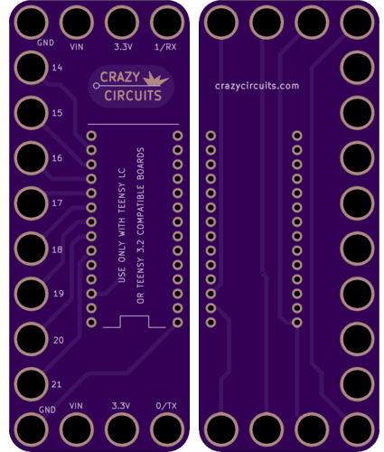

<!--- start title --->
# 4x10 Teensy LC Breakout Module v1.1
A Lego-compatible Crazy Circuits module

- Updated: 13 Feb 2017
- Website: http://browndoggadgets.com/
- Company: Brown Dog Gadgets
- License: CERN Open Hardware License v1.2.

<!--- end title --->
Breakout board for the Teensy LC. 

<!--- bom start --->
### Bill of Materials

|Ref|Qty|Description|Pjrc PN|
|---|---|-----------|------|
|U1|1|TEENSY LC DEVELOPMENT BOARD|TEENSY LC|

<!--- bom end --->

### Manufacturing Notes

This board must be v-scored. Do not panelize with support tabs or mousebites.

