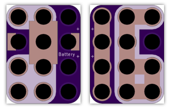

<!--- start title --->
# 4x3 CR2032 Coin Cell Battery Module v1.0
A Lego-compatible Crazy Circuits module.

Updated: 19 Dec 2016

Website: http://browndoggadgets.com/
Company: Brown Dog Gadgets
License: All rights reserved.

<!--- end title --->
This is a holder for a 3V CR2032 coin cell battery. The extra three pads on the bottom make it usable with Crazy-compatible magnets.

### Bill of Materials

<!--- bom start --->
<!--- bom end --->

