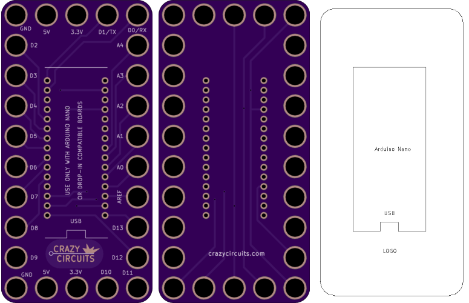

<!--- start title --->
# 5x10 Arduino Nano Breakout Module v1.0
A Lego-compatible Crazy Circuits module

- Updated: 03 Feb 2017
- Website: http://browndoggadgets.com/
- Company: Brown Dog Gadgets
- License: CERN Open Hardware License v1.2.

<!--- end title --->

Breakout board for the Arduino Nano.

<!--- bom start --->
### Bill of Materials

|Ref|Qty|Description|Digikey PN|
|---|---|-----------|------|
|J1|1|ARDUINO NANO DEVELOPMENT BOARD|1050-1001-ND|

<!--- bom end --->

