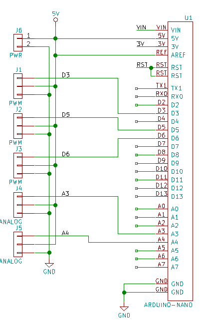

<!--- start title --->
# 5x11 Arduino Nano Robot Breakout v1.2
A Lego-compatible Crazy Circuits module

- Updated: 4 Feb 2018
- Website: http://browndoggadgets.com/
- Company: Brown Dog Gadgets
- License: All rights reserved.
<!--- end title --->

This robot controller module comes with an Arduino Nano, three servo headers, and two analog headers. 

We recommend buying one 20-pin Harwin connector (P/N [M20-9992046](https://www.digikey.com/products/en?keywords=M20-9992046)) and breaking it into pieces to place the six male headers.

<!--- bom start --->
### Bill of Materials

|Ref|Qty|Description|Digikey PN|
|---|---|-----------|------|
|J1 J2 J3 J4 J5|5|HEADER MALE 3POS TH 1x03 0.1IN|952-1902-ND|
|J6|1|HEADER MALE 2POS TH 1x02 0.1IN|952-2262-ND|
|U1|1|ARDUINO NANO BOARD|1050-1001-ND|

<!--- bom end --->

