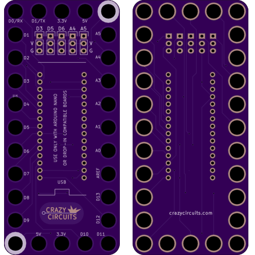
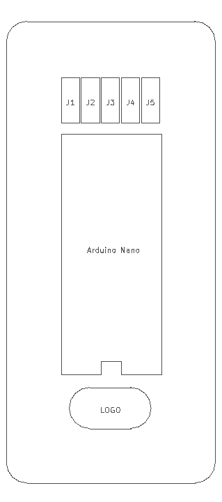

<!--- start title --->
# 5x11 Arduino Nano Robot Breakout v1.0
A Lego-compatible Crazy Circuits module

Updated: 24 Apr 2017

- Website: http://browndoggadgets.com/
- Company: Brown Dog Gadgets
- License: All rights reserved.
<!--- end title --->

This robot controller module comes with an Arduino Nano, three servo headers, and two analog headers. 

<!--- bom start --->
### Bill of Materials

|Ref|Qty|Description|Digikey PN|
|---|---|-----------|------|
|J1 J2 J3 J4 J5|5|HEADER MALE 3POS TH 1x03 0.1IN|952-1902-ND|
|U1|1|ARDUINO NANO BOARD|1050-1001-ND|

<!--- bom end --->

