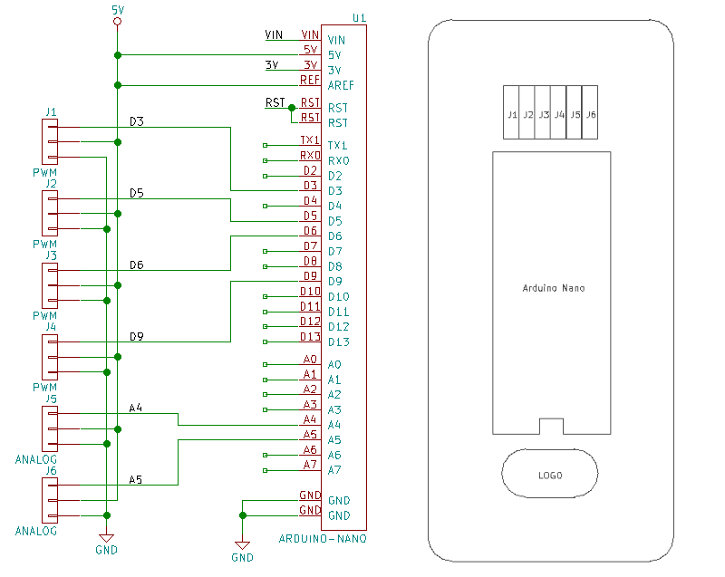
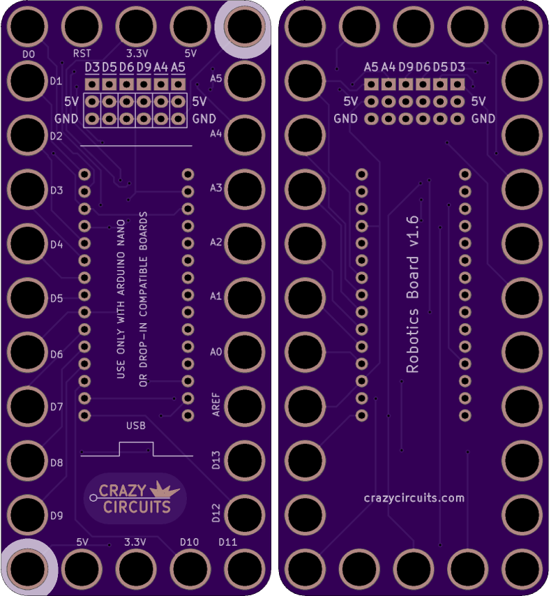

<!--- start title --->
# 5x11 Arduino Nano Robot Breakout v1.6
A Lego-compatible Crazy Circuits module

- Updated: 24 Sep 2018
- Website: http://browndoggadgets.com/
- Company: Brown Dog Gadgets
- License: CERN Open Hardware License v1.2.
<!--- end title --->

This robot controller module comes with an Arduino Nano, four servo headers, and two analog headers. 

We recommend buying one 20-pin Harwin connector (P/N [M20-9992046](https://www.digikey.com/products/en?keywords=M20-9992046)) and breaking it into pieces to place the six male headers.

<!--- bom start --->
## Bill of Materials

|Ref|Qty|Description|Digikey PN|
|---|---|-----------|------|
|J1-6|6|HEADER MALE 3POS TH 1x03 0.1IN|952-2264-ND|
|U1|1|ARDUINO NANO BOARD|1050-1001-ND|

<!--- bom end --->

### Manufacturing Notes

This board must be v-scored. Do not panelize with support tabs or mousebites.

 

