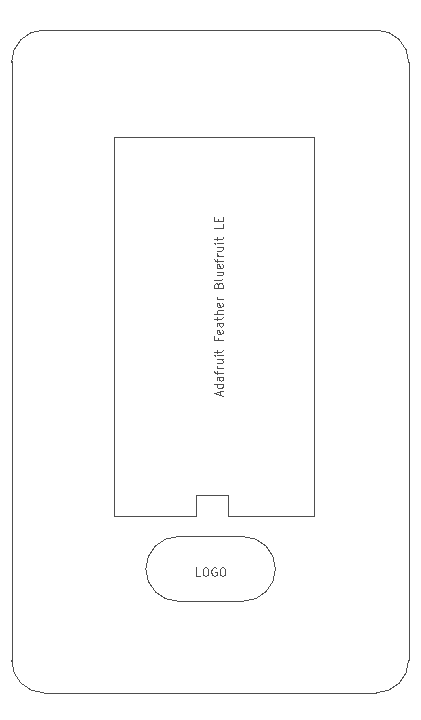
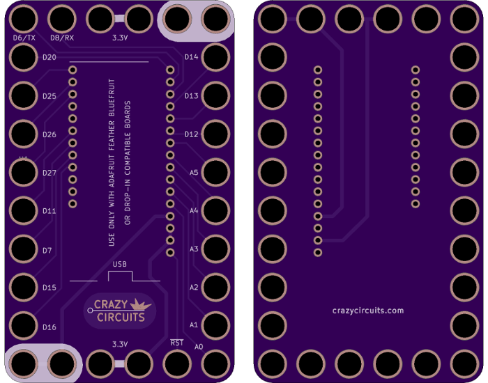
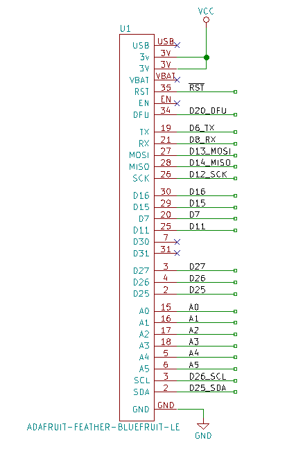

<!--- start title --->
# 6x10 Feather Huzzah ESP8266 Module v1.0
A Lego-compatible Crazy Circuits module

- Updated: 8 Feb 2018

- Website: http://browndoggadgets.com/
- Company: Brown Dog Gadgets
- License: All rights reserved.
<!--- end title --->

Breakout board for the Adafruit Feather Bluefruit Low Energy (LE) module so you can add Bluetooth to your projects.

<!--- bom start --->
### Bill of Materials

|Ref|Qty|Description|Digikey PN|
|---|---|-----------|------|
|U1|1|ADAFRUIT FEATHER BLUEFRUIT LE|1528-2095-ND|

<!--- bom end --->

