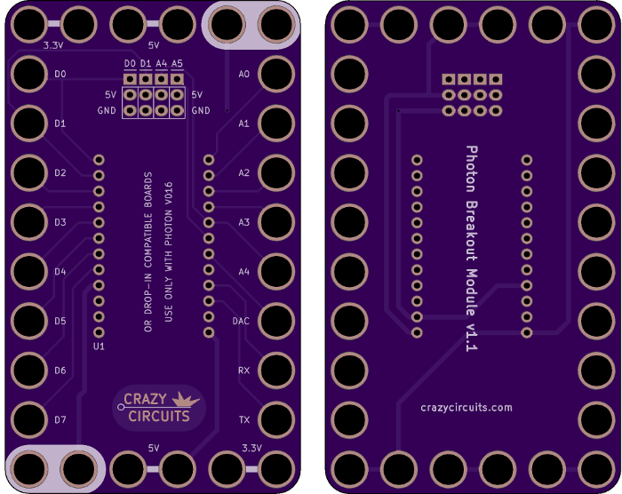
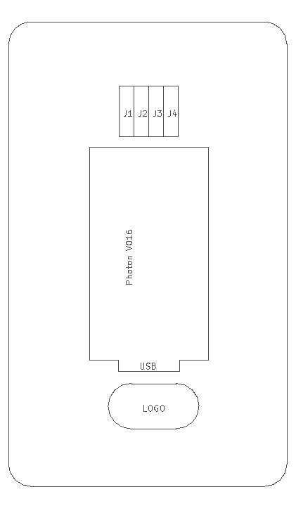

<!--- start title --->
# 6x10 Photon Breakout Module v1.0
A Lego-compatible Crazy Circuits module

- Updated: 31 Jul 2018
- Website: http://browndoggadgets.com/
- Company: Brown Dog Gadgets
- License: All rights reserved.
<!--- end title --->

This breakout board is for use with the Particle Photon V016 and all pin-compatible boards. 

Powering it from the USB cable will output 5V and 3.3V. There are four three-pin servo headers.   

We recommend buying one 20-pin Harwin connector (P/N [M20-9992046](https://www.digikey.com/products/en?keywords=M20-9992046)) and breaking it into pieces to place the six male headers.

<!--- bom start --->
### Bill of Materials

|Ref|Qty|Description|Digikey PN|
|---|---|-----------|------|
|U1|1|PARTICLE PHOTON V016|1878-1000-ND|

<!--- bom end --->

### Manufacturing Notes

This board must be v-scored. Do not panelize with support tabs or mousebites.

