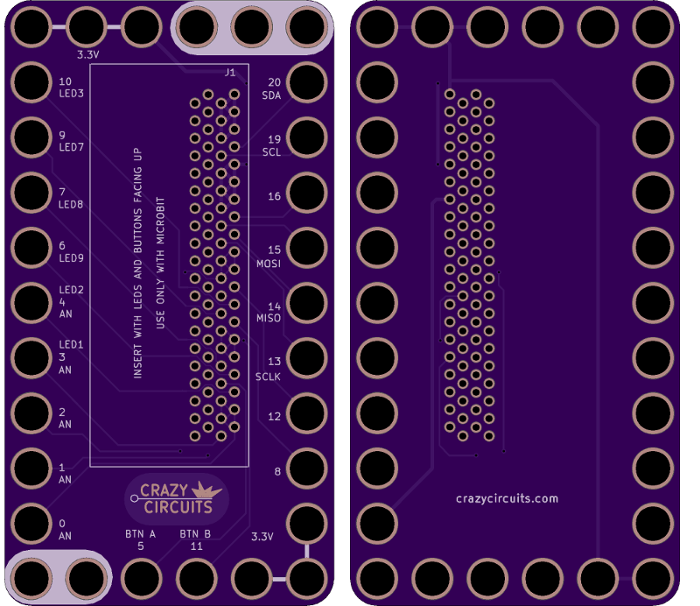
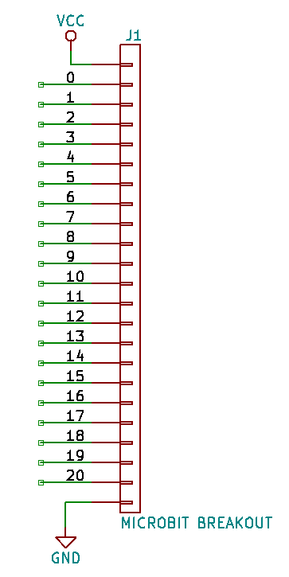

<!--- start title --->
# 6x11 Microbit Breakout Module v1.0
A Lego-compatible Crazy Circuits module

- Updated: 9 Feb 2018

- Website: http://browndoggadgets.com/
- Company: Brown Dog Gadgets
- License: CERN Open Hardware License v1.2.
<!--- end title --->

Slide the Microbit into the connector with the LEDs and buttons facing up, and you have access to all the pins for I2C, SPI, touch, analog input, the Microbit LEDs, buttons, and assorted extra digital input/output. 

<!--- bom start --->
### Bill of Materials

|Ref|Qty|Description|Adafruit PN|
|---|---|-----------|------|
|J1|1|HEADER MALE 80POS TH 4x20 MICROBIT R/A|3342|

<!--- bom end --->

