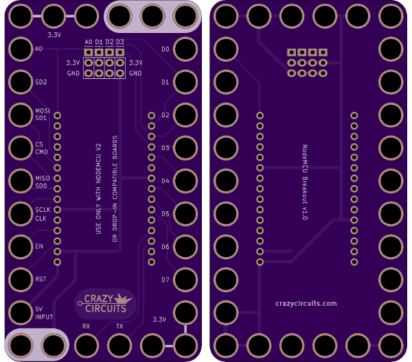
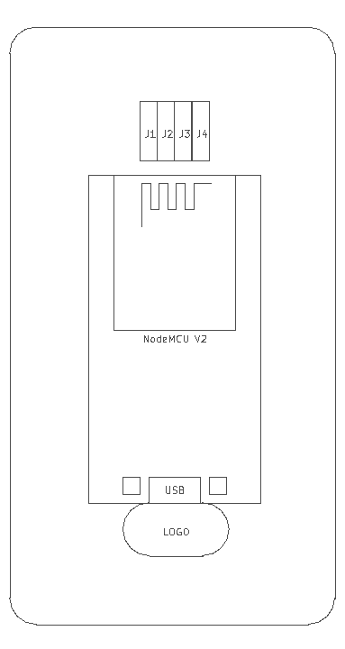
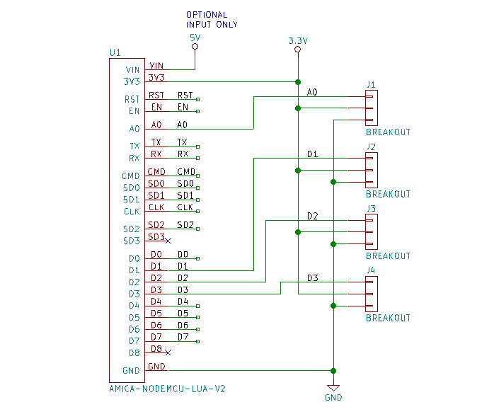

<!--- start title --->
# 6x11 NodeMCU V2 Breakout Module v1.0
A Lego-compatible Crazy Circuits module

- Updated: 18 Jul 2018

- Website: http://browndoggadgets.com/
- Company: Brown Dog Gadgets
- License: All rights reserved.
<!--- end title --->

The NodeMCU project calls this version of the board v1.0, but it's commonly called the V2 in production. 

This is the vendor we used: [Banggood P/N 1097112](https://www.banggood.com/NodeMcu-Lua-WIFI-Internet-Things-Development-Board-Based-ESP8266-CP2102-Wireless-Module-p-1097112.html)

Here's the documentation from NodeMCU, including a handy pinout diagram: [NodeMCU v1.0 docs](https://github.com/nodemcu/nodemcu-devkit-v1.0)

The module can be powered by plugging in USB or by applying 5V to the VIN input pin on the lower left. Don't expect to pull 5V out of the module: 5V is input only. This is a 3.3V module.

<!--- bom start --->
### Bill of Materials

|Ref|Qty|Description|Banggood PN|
|---|---|-----------|------|
|U1|1|NODEMCU LUA V2 ESP-12E DEV KIT|1097112|

|Ref|Qty|Description|Digikey PN|
|---|---|-----------|------|
|J1 J2 J3 J4|4|HEADER MALE 3POS TH 1x03 0.1IN|952-1902-ND|

<!--- bom end --->

### Manufacturing Notes

This board must be v-scored. Do not panelize with support tabs or mousebites.

