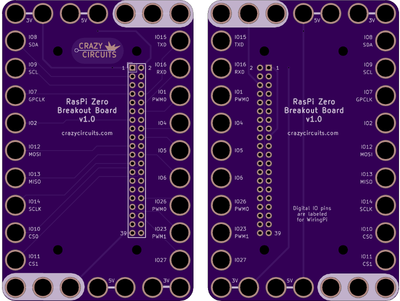
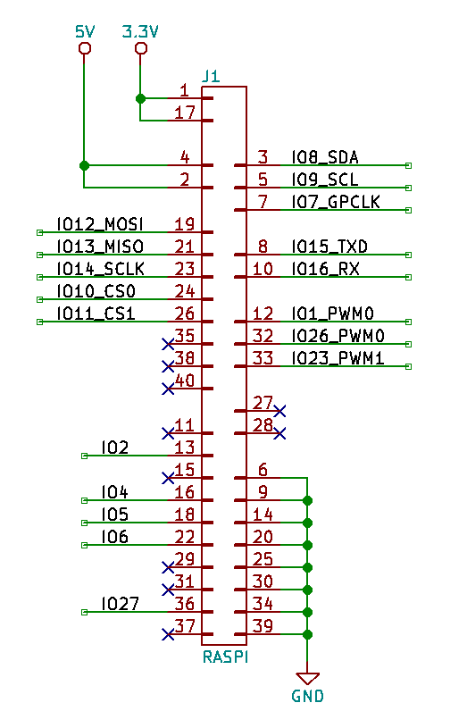

<!--- start title --->
# 7x11 Raspberry Pi Zero Breakout Module v1.0
A Lego-compatible Crazy Circuits module

- Updated: 12 May 2018

- Website: http://browndoggadgets.com/
- Company: Brown Dog Gadgets
- License: All rights reserved.
<!--- end title --->

This breakout board is for use with the Raspberry Pi Zero. The IO pin numbers are marked with the numbers you'd use with WiringPi. 

<!--- bom start --->
### Bill of Materials

|Ref|Qty|Description|Digikey PN|
|---|---|-----------|------|
|J1|1|HEADER FEMALE 20POS TH 2x20 0.1IN|S6106-ND|

<!--- bom end --->

