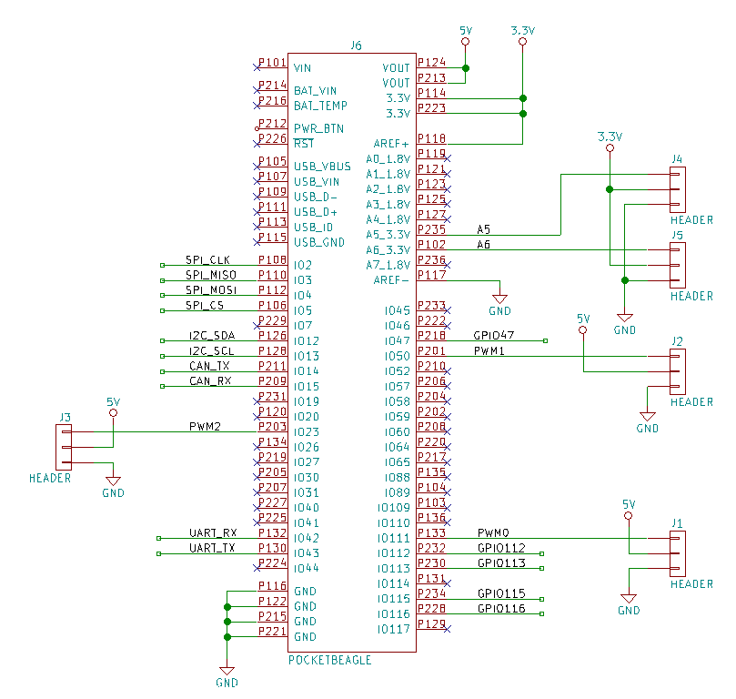
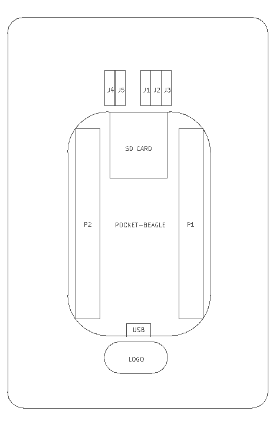
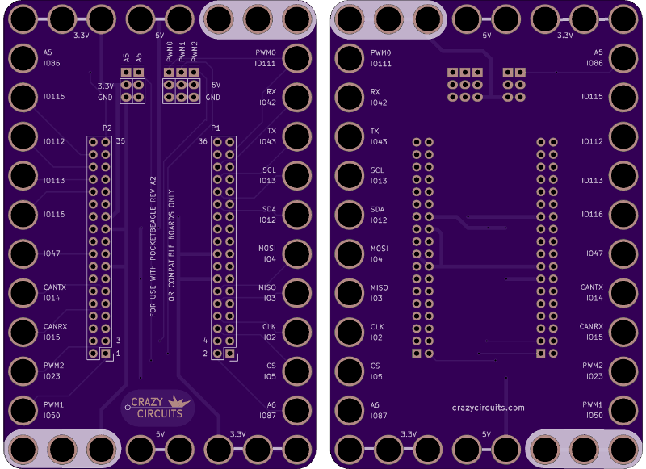

<!--- start title --->
# 8x12 PocketBeagle Breakout v1.0
A Lego-compatible Crazy Circuits module

- Updated: 6 Aug 2018

- Website: http://browndoggadgets.com/
- Company: Brown Dog Gadgets
- License: CERN Open Hardware License v1.2
<!--- end title --->

Breakout board for the PocketBeagle.

<!--- bom start --->
### Bill of Materials

|Ref|Qty|Description|Digikey PN|
|---|---|-----------|------|
|J1 J2 J3 J4 J5|5|HEADER MALE 3POS TH 1x03 0.1IN|952-1902-ND|
|J6|1|POCKETBEAGLE|POCKETBEAGLE-SC-569-ND|

<!--- bom end --->

\newpage

### Manufacturing Notes

This board must be v-scored. Do not panelize with support tabs or mousebites. 

