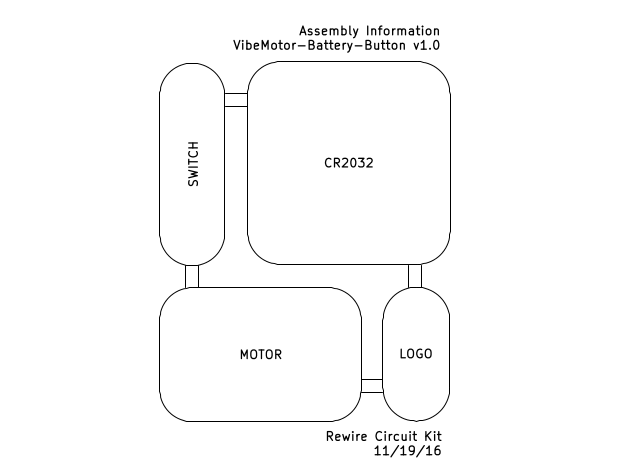

# VibeMotor-Button-Battery v1.0

Rewire Circuit Kit, Brown Dog Gadgets  

Circuit kit that can be snapped apart into three Lego-compatible modules. Just add a coin cell battery and turn on the motor by pressing the pushbutton. 

|Module|Size|Description|Vendor|Part Number|
|------|----|-----------|------|-----------|
|CR2032|3x3|CR2032 Battery|Digikey|952-1735-1-ND|
|MOTOR|2x3|6mm Vibration Motor|Precision Microdrives|<a href="https://www.precisionmicrodrives.com/product/306-114-6mm-vibration-motor-10mm-type">306-114</a>|
|SWITCH|1x3|Pushbutton|Digikey|SW400-ND|

