# Creating New Circuits and Modules

This section is for developers to create new Crazy Circuits modules in KiCad 5.

### Submit a Module Request

If you don't use KiCad and want us to create a module for you, please follow the instructions here:

​	&raquo; [Submit a Module Request](submit-a-module-request.md).

## Table of Contents

We love contributions! Here's how to do it:

1. Install KiCad and git
1. Fork the Crazy Circuits GitHub Repository
1. Name the New Module
1. Unpack the new-project.zip into that folder
1. Rename and edit as needed
1. Design Decisions and the KiCad Libraries
1. Create the schematic and any new symbols
   1. Schematic Style
   1. Art and Logos
   1. Working with Component Symbols
   1. Creating a New Symbol
   1. Edit the Symbol Fields
   1. Generate the Netlist
1. Create the layout and any new footprints
   1. Design Rules and Layer Setup
   1. Design Decisions
   1. Footprint Guidelines
1. Edit the fabrication notes to specify module color
1. Fill in the description section of the README
1. Optionally create the BOM, gerbers, and pos file
1. Otherwise, we will auto-generate the docs
1. Submit a pull request

## How to Contribute

### 1. Install KiCad and git

This guide assumes you're comfortable with KiCad, GitHub, and git. 

KiCad is a free, open source schematic capture and board layout tool that can be downloaded for Linux, Mac, and Windows. [Get KiCad here](kicad-pcb.org). The Crazy Circuits project prefers modules made with KiCad 5. 

Complete documentation can be found at [KiCad docs](http://docs.kicad-pcb.org/).

If you don't use KiCad and want us to create a module for you, please follow the instructions here:

​	&raquo; [Submit a Module Request](submit-a-module-request.md).

### 2. Fork the Crazy Circuits GitHub Repository

First, fork your the CrazyCircuits repository to your own GitHub account. It's easiest for us if you make changes to that forked repository and then submit a pull request.

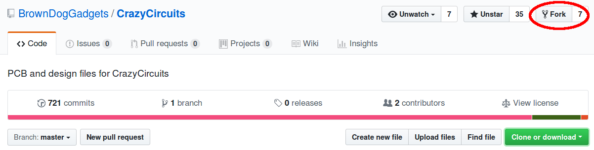

Clone your forked repository to your local machine. On the command line, this looks something like:

​	`git clone https://github.com/YOURNAME/CrazyCircuits.git`

### 3. Name the New Module

We've automated how we generate the project documentation. If you name the module in a particular way, you only have to create the design files and edit the project README before submitting the pull request. We will run a one-liner to create all the output zip files, output BOMs, and PDF documentation. 

The name of the module's folder and files should have dashes instead of spaces. 

The longform name of the module for the documentation should follow the same 

Versions are tracked separately and should not be added to the module name.

In general, names should start with the size/shape of the Lego-compatible holes. Then go from most general to most specific, up to and including the part number and SMT/TH if necessary. If this is a version on an existing module, copy that module naming pattern and adjust only the minimum necessary, such as changing SMT to TH. 

**Examples:**

| Folder/Files Name                | Longform Module Name                    |
| -------------------------------- | --------------------------------------- |
| 2x4-Grove-Sensor                 | 2x4 Seeed Grove Sensor Module           |
| 2x2-Screw-Terminal-3.5mm-Pitch   | 2x2 Screw Terminal 3.5mm-Pitch Module   |
| 2x2-LED-Blue-SMT-Limited         | 2x2 Current-Limited Blue SMT LED Module |
| 2x3-Dark-Detector                | 2x3 Dark Detector Module                |
| 3x4-ATtiny85-8DIP-Breakout       | 3x4 ATTiny85 8DIP Breakout Module       |
| 2x3-Mini-Potentiometer-3361P-SMT | 2x3 Mini Potentiometer 3361P SMT Module |
| 2x3-Mini-Potentiometer-3386P-TH  | 2x3 Mini Potentiometer 3386P TH Module  |
| 5x11-Arduino-Nano-Robot-Version  | 5x22 Arduino Nano Robot Breakout Module |
| 7x11-RasPi-Zero-Breakout         | 7x11 RasPi Zero Breakout Module         |

### 4. Copy the new-project.zip into that folder

We provide a module template that includes a blank KiCad 5 project template, the README, and a proj.json file with all the information we'll need to automatically generate all the project documentation.  

Create a folder in  `CrazyCircuits/Circuit-Kits/Modules` using the folder module name.

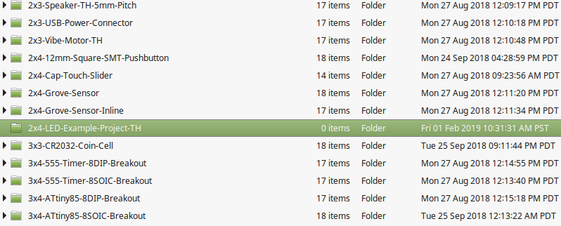

Unpack the contents of [newproject.zip](templates/newproject.zip) into this new folder.

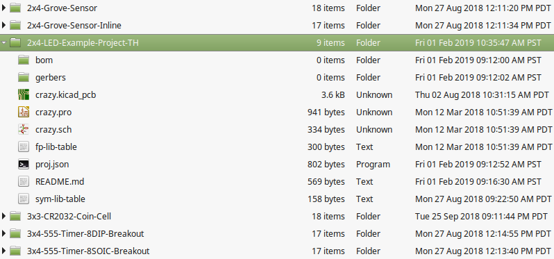

### 5. Rename and edit as needed

First, rename the three KiCad project files.

| Default         | Example Name                         |
| --------------- | ------------------------------------ |
| crazy.kicad_pcb | 2x4-LED-Example-Project-TH.kicad_pcb |
| crazy.pro       | 2x4-LED-Example-Project-TH.pro       |
| crazy.sch       | 2x4-LED-Example-Project-TH.sch       |

Next, set up the library locations to reflect the absolute path the CrazyCircuits repository on your machine.

Because KiCad doesn't support relative library paths, all the files currently have library paths reflecting the Brown Dog Gadgets development environment:`/home/wicker/proj/CrazyCircuits`.

1. Open the `.pro` file and replace `/home/wicker/proj` on line 40 with your path.  Save and close the file.
2. Open the `fp-lib-table` file, do the same on lines 2 and 3.
3. Open the `sym-lib-table` file and do the same on line 2.

Finally, manually open and edit the following files in the text editor of your choice.

#### proj.json

1. Change line 4: "date_create" to today's date in the same `DD MON YEAR` format.
2. Change line 5: "date_update" to today's date in the same `DD MON YEAR` format.
3. Change line 11: "proj_name" to the file/folder name.
4. Change line 15: "title" to your longform module name.

#### README.md

1. Change the module name on line 2 to your longform module name. 

2. There's no need to change the updated date if you don't want to. This will be updated automatically when we generate all the project docs. 

3. Replace the line containing `THIS IS THE DESCRIPTION SECTION...` with a short (or long!) description of the module. Here are a couple of examples: 

   ```
   This robot controller module comes with an Arduino Nano, four servo headers, and two analog headers.
   
   We recommend buying one 20-pin Harwin connector (P/N M20-9992046) and breaking it into pieces to place the six male headers.
   ```

   ```
   This simple tilt switch is either closed or open, depending on which end of the tube the ball has rolled down.
   ```

   ```
   Surface mount RGB LED with a common anode. Connect the Common (C) to 3.3V.
   ```

### 6. Design Decisions and the KiCad Libraries

First, it's important to understand that KiCad separates the schematic and component symbols from the board layout and component footprints. 

We at Crazy Circuits put all the bill of material information in the schematic symbols. We then play somewhat fast and loose with our footprint library. Each module is small and easy to check by hand, so we have made some inadvisable design choices ... please don't use existing module footprints and layouts as an example of best practices. Please follow this guide instead.

Schematic symbols can be found in the crazy.lib and crazy.dcm files. Do not edit these files by hand. 

Component footprints are individual .kicad_mod files in the Crazy_Circuits.pretty and Crazy_NonLego.pretty libraries. Do not edit these files by hand. 

### 7. Create the schematic and any new symbols

#### Schematic Style

The schematics are often included in the educational materials so we prefer a fully wired schematic where all the components are laid out spatially in a way easily understood by kids who are learning electronics. We may not use the entire schematic in the final educational materials, but the more info you give us here, the more the curriculum folks have to work with.

Here are some examples of the style we're looking for:


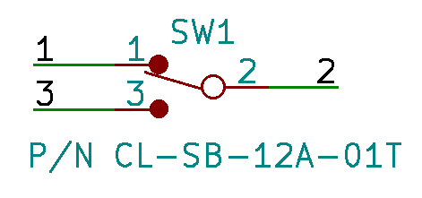

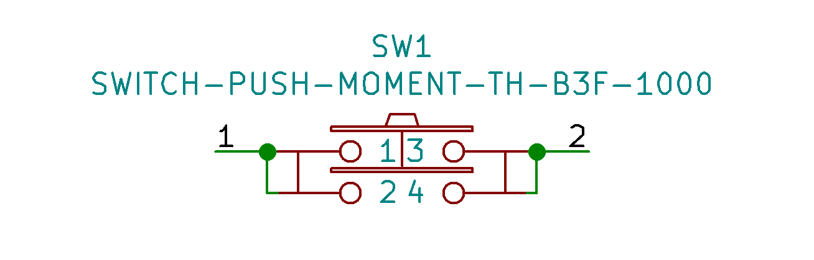

#### Art and Logo Modules

If you're creating a module without any components, place a line of text in the middle of the schematic and generate a netlist so we know the schematic is empty on purpose. 


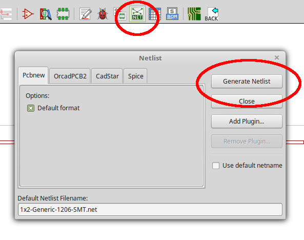

#### Working with Component Symbols

We use typical KiCad symbols in terms of look. We recommend opening up the schematic editor and adding symbols to quickly sort through the library. 

The most important thing to know is that we add our bills of materials information to our symbols using the built-in KiCad 'fields' tool. A complete symbol looks like this: 

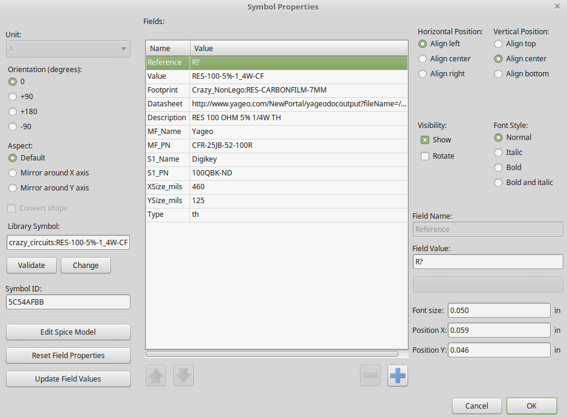   	

When making a module that will use a new part we don't have in our library, the first step is to identify the manufacturer, the manufacturer part number, a vendor with the item currently in stock, and the vendor part number. We frequently use Digikey and Mouser, but also commonly Adafruit and Sparkfun. 

#### Create a New Symbol

To create a new symbol, it's easiest to start with a similar symbol that has all the fields we're looking for. Find this reference symbol and add it to the schematic:

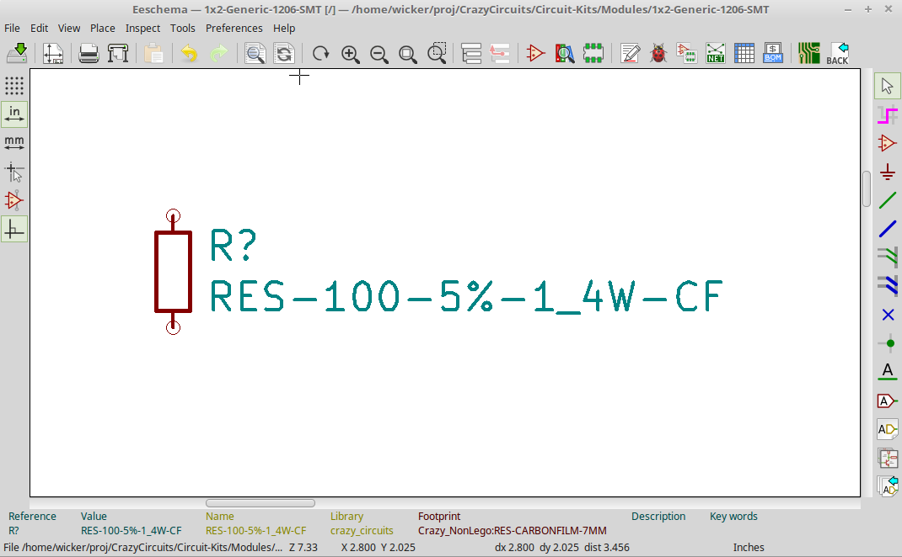

Hover over the symbol and press Ctrl+E to open this symbol in the library symbol editor.

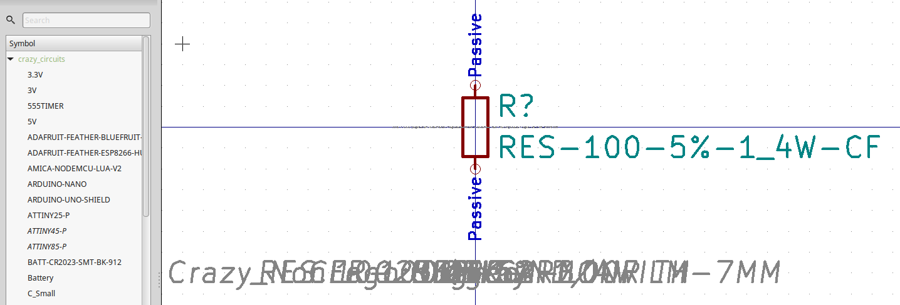

The first order of business is to duplicate this symbol and rename it. For this example, let's say we wanted to add a 470-ohm resistor in the same 5%, 1/4W family as this 100-ohm resistor. Find and right click on the symbol in the list on the left.  

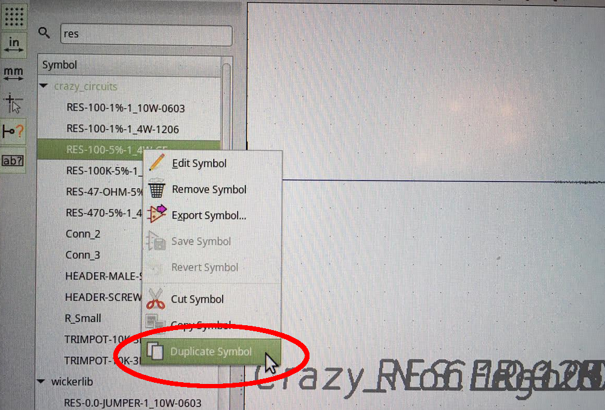

The green entry in the left-hand list shows the symbol you're currently editing. In this case, it's still the original 100-ohm resistor. Clicking on Duplicate Symbol creates a new, black, bold symbol entry in the list that ends in `_0` with an asterisk next to it. This just means that symbol has unsaved changes. 

Because we want to edit that new 100-ohm resistor symbol (to make it a 470-ohm resistor), double click on the bolded black symbol entry. When it turns green, you know it's the one that's open in your editor.

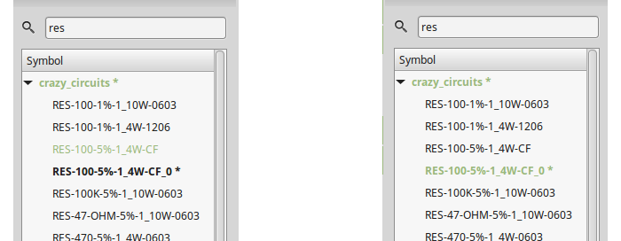

Change this symbol's value in the editor window by using 'e' over the value text. Follow the same sort of naming scheme. In this case, just change 100 to 470, since all other values will be the same. 

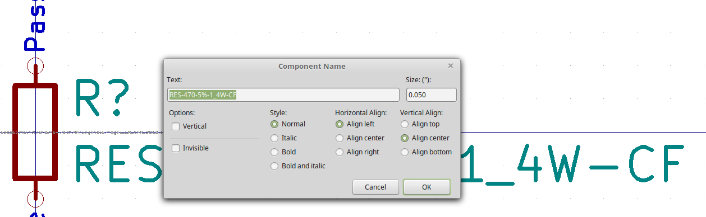

Click OK and the symbol will show the new value in both the editor and the left-hand symbol list.

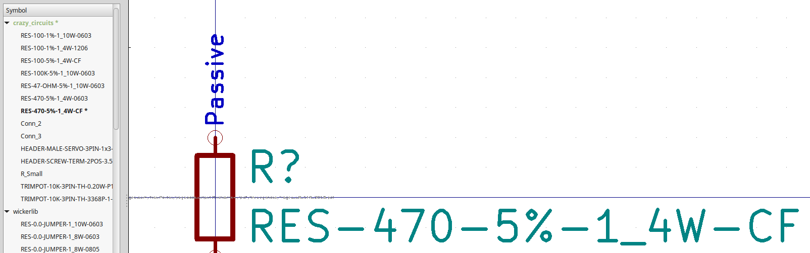

 Hit Ctrl+S or use the GUI menu to save the symbol.

#### Edit the symbol fields 

The pile of gray text strings at the bottom is actually the set of fields. You can hover and hit 'e' to edit them one by one, but it's easier to open the fields editor by clicking on the T symbol in the top menu bar.

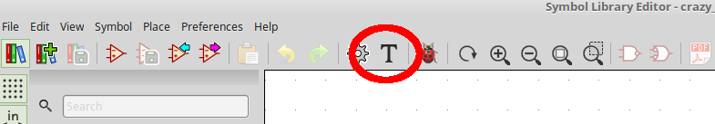

Use the mouse or the arrow keys to edit each of the fields. 

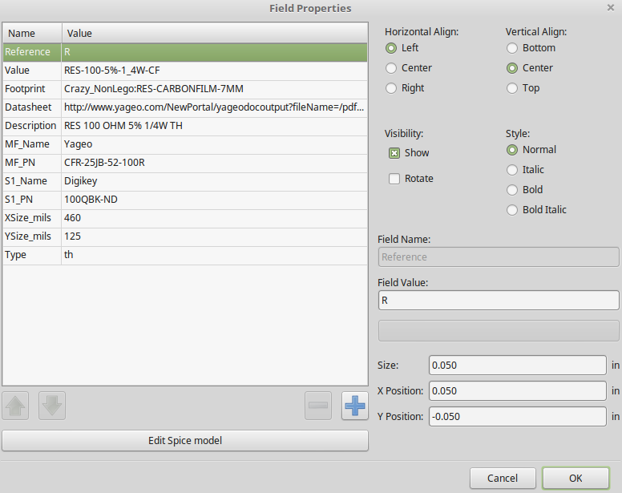

The last three fields contain information for the automated assembly process. The XSize_mils and YSize_mils are the dimensions of the part in mils (thousandths of an inch), and this can be approximate from the datasheet. The type is either `th` for 'through-hole' or `smt` for 'surface mount'. 

For art with no corresponding assembly requirements, such as a logo, use `dnp` for 'do not place'.

#### Generate the Netlist

When the symbols are created, placed, and connected with wires according to the examples above, the last step is to create the netlist. Click on the green 'NET' symbol in the top bar and 'Generate Netlist'.


Then you can save and exit the schematic editor.

### 8. Create the layout and any new footprints

*The project template comes with a set of design rules that we've found to work nicely with our most common fabricators and with some of KiCad's auto layout quirks. We've also included a text box containing the Fabrication Notes on the Dwgs.User layer.* 

All modules should have components only on one side, hereafter referred to as the "top" side.

To start, get an idea of the size of the components and draw out the rough layout of the module on a piece of paper or a dry erase board. Figure out where VCC and GND should go. Signals should only be broken out on the outer ring of the module, so as to be compatible with conductive tape in projects. 

Remember, these modules should be friendly and easy to use for kids and their teachers.   

#### Design Rules and Layer Setup

Our KiCad template comes with design rules included. You can find them under `Setup` in the top menu.

It's important to know that 0.006 inches is also called 6 mils, which is the same as 6 thousandths of an inch, and both are equivalent to 0.1524 mm. We will use mils in this document. 

While the minimum track width is 6 mils in the design rules for trace minimum, we recommend a 10 mils minimum and have set that as a default in the net classes editor. There shouldn't be a need to edit either of these templates, but the following screenshots show the default settings just in case you need them.

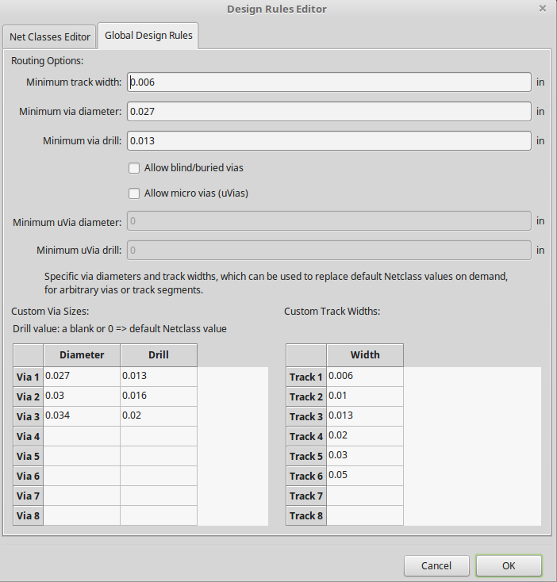

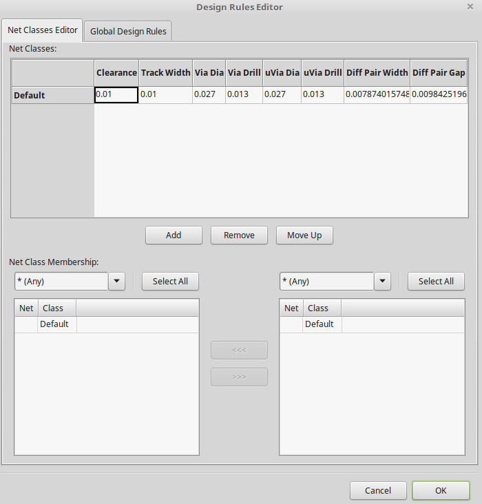

KiCad's layout editor lets you show and hide layers while you're editing. We expect info on all of the layers on the next screenshot, and this guide will refer to the layers according to their names as shown here:

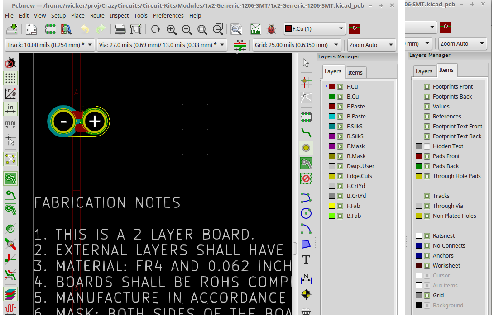

#### Design Decisions

There are two ways to approach making a new module. 

**For the first way**, you can make one footprint for the entire module, which we prefer, but which is more complicated. You'll open a generic module in the KiCad footprint editor, save it as the new name of your module, and add the component footprints, copper routing, and any silk by hand to the module. When saved, you can go back to the KiCad layout editor and add the whole module as a component. Doing it this way means the Design Rules Checker will not work, so you have to check against the design rules by hand. 

That's obviously a lot more complicated for a first-time KiCad designer, so we totally accept the second way!

**For the second way**, you can create the component footprints you need in the Crazy_NonLego library, then go back to the KiCad layout tool and add a generic Lego-compatible module from the Crazy_Circuits library, add those added Crazy_NonLego components, and wire them up in the KiCad layout tool with the 'x' command. The footprint pads have to match the expected pads from the schematic symbols (through the netlist) and you'll be able to use the Design Rules Checker.   

#### Footprint Guidelines

In either case, here are some module guidelines. 

We remap the hotkeys so 'd' instead of 'bksp' is delete, because it's right in the home row and easier to hit.   

##### License

All modules should be released under the CERN Open Hardware License v1.2.

##### Pads and Drills

The easiest thing is to set KiCad to use millimeters, which you can do by clicking 'mm' on the left menu.

The holes for Lego studs must be 4.98mm diameter.

Minimum total Lego hole total annular ring diameter is 6mm.

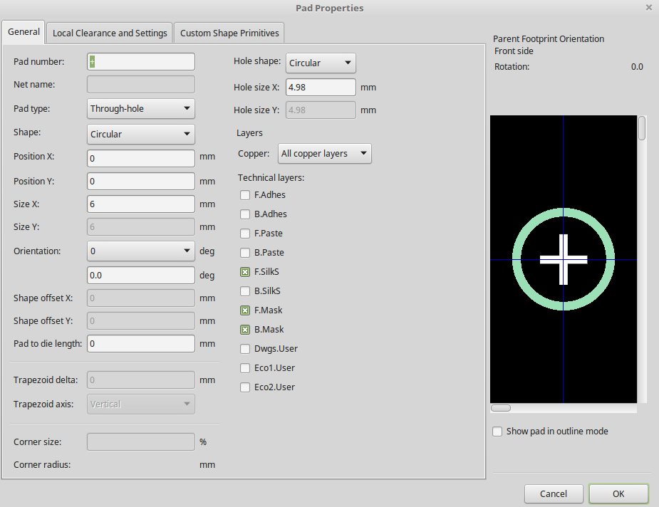

##### New Lego-Compatible Module

Even if you're making a totally new generic Lego-compatible module footprint because you need a new size that we don't have, it's best to start with one that's most of the way there. 

For example, if you need a 2x6, open a 2x3 and rename it to be the generic 2x6. Once you set the custom user grid size, you can just select the 2x3 pads, duplicate with Ctrl+D, and move them along the grid into the correct position.

Set the KiCad layout grid size to 8mm by going to `View > Grid Settings` in the top menu: 

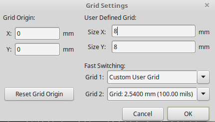

You can set the KiCad grid by right clicking in the background and choosing  `Grid > Custom User Grid`:

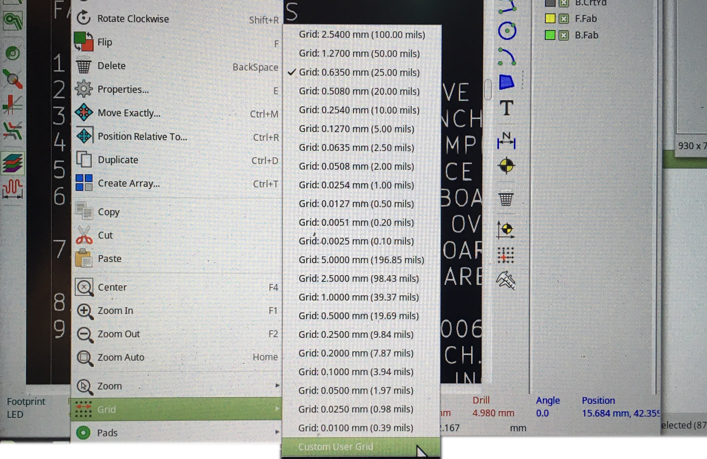

The big Lego-compatible holes should always be centered on grid lines. The origin (where the blue lines of the x and y axis cross) should be centered in the lowest leftmost hole. Many of our modules are not currently set up that way, but we'd appreciate if all new modules are.

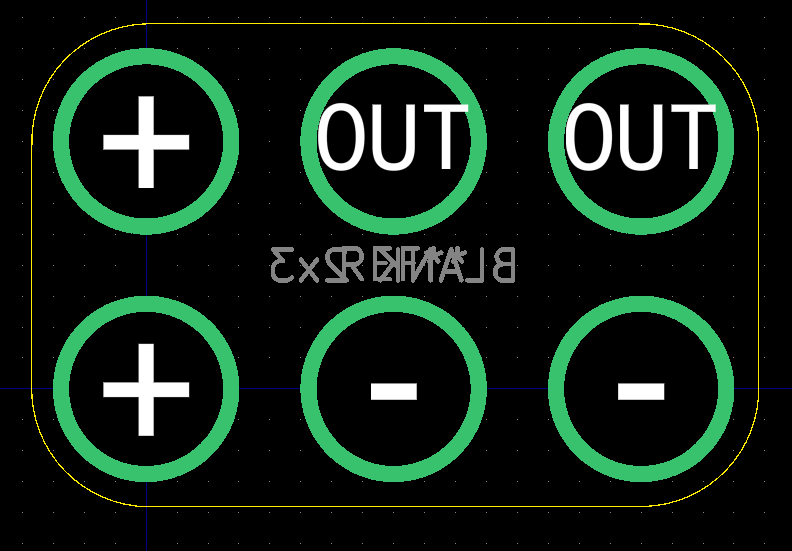

To verify, click 'e' to edit the pad properties of the lowest leftmost pad and make sure its origin is at 0,0. You can also verify the size of the pad is 6mm (hole + both sides of the annular ring) and the hole itself is a circular plated through-hole of width 4.98mm.


##### Silk Markings

All modules will have white silk.

We designate the VCC, VIN, other reference high voltage pin, or 'pin 1' of a bidirectional part in white silk with a cross (+) or explicitly with the name of the signal (VIN, VCC), and so on.

We designate the reference ground or the 'pin 2' of a bidirectional part with white silk. Add a graphic line on the F.Silk layer with thickness of 7 mm and cover this pin or pins, extending all the way to the edge of the board. KiCad will remove any silk from exposed copper automatically, so don't worry about covering them. 

If there are only two pins on a part, you can just mark the ground side.

A good example module for both silk and mask is the `SWITCH-12mm-SQUARE-B3FS-4000-SMT-2x2` module in the Crazy_Circuits footprint library. It demonstrates some interesting silk, copper, and mask adjustments to accommodate a surface mount part.

The holes are not plated in this module, because the surface mount pads made that impossible.

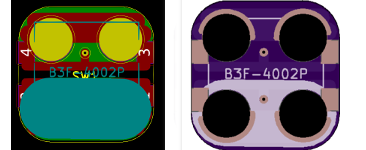

##### Mask Guidelines

The template comes with a preset Pad-to-Mask clearance of 10 mils (0.01 inches or 0.254 mm) to accommodate a range of fab house tolerances. 

Any marks on the F.Mask or B.Mask layers are interpreted as *negative*. That is, solder mask will be placed everywhere except for where those markings are. All pads should have F.Mask and B.Mask markings included by default, which exposes the copper annular ring and allows kids to connect to the signals with conductive tape, conductive thread, or alligator clips. 

If you have a surface mount part, you must leave 30 mils of mask as a solder dam between any surface mount pad and any Lego-compatible plated hole. Otherwise, the solder may flow from the surface mount pads into the hole and make it so the module can't fit down onto the Lego block.  

To make a solder dam, hit 'e' while hovering over that pad and uncheck the F.Mask box on that pad. 

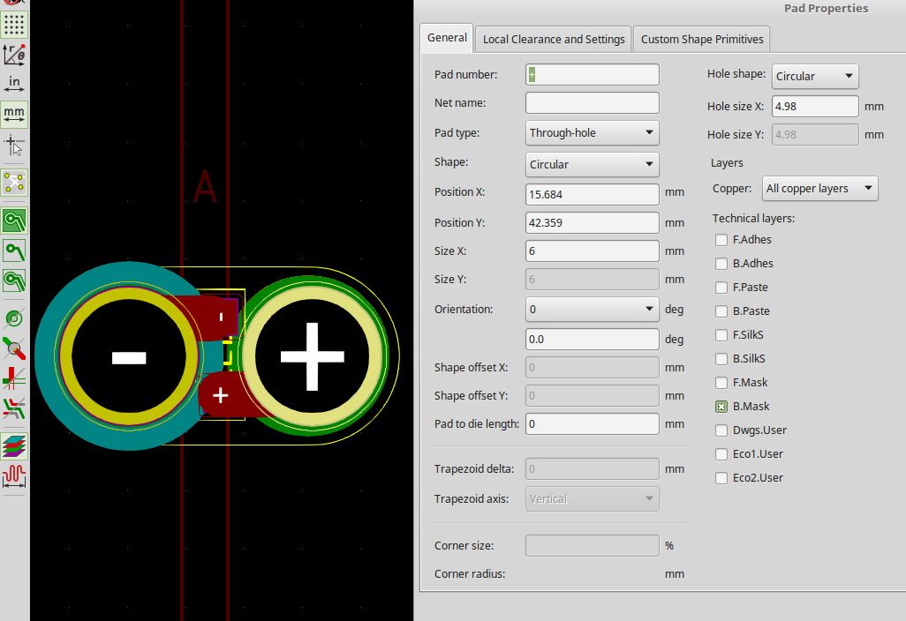

Then use the `Add graphic arc` tool

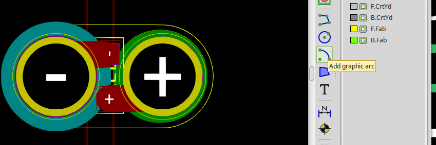 

With the grid at some larger size so you can start at the center of the pad, add the graphic arc to expose the copper ring. One of the white squares on the arc will allow you to make the diameter larger or smaller, and the other will allow you to cover more of the ring. The arc should have a thickness of 0.5 mm. 

Once you've placed the arc for the first time, lowering the grid setting to 1 or 2 mils will let you have more fine control on placement of the mask.

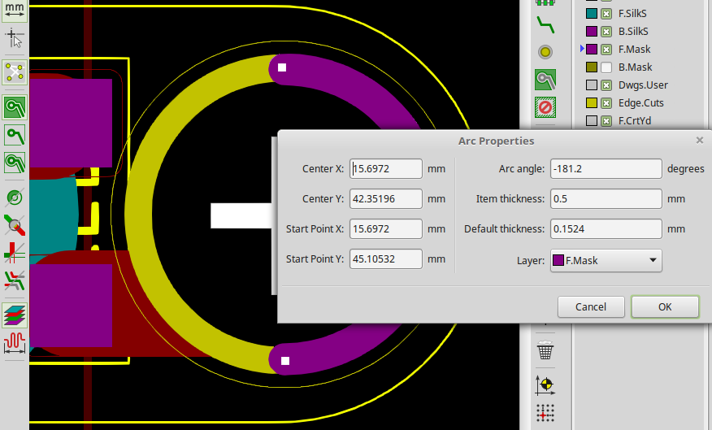

### 9. Edit the fabrication notes to specify module color

The fabrication notes included on the Dwgs.User layer are the same for all modules, except for the mask color, which depends on the type of module.

| Mask Color | **Module Purpose**                                           |
| ---------- | ------------------------------------------------------------ |
| Red        | Inputs: Buttons, Switches, Photocells, Cap Touch             |
| Blue       | Logos, Art                                                   |
| Orange     | Power: Batteries, USB                                        |
| Black      | Outputs: LEDs, Lamps, Speakers, Servos, Motors, Buzzers      |
| Green      | Microcontrollers                                             |
| Purple     | Connectors: Push Terminals, Screw Terminals, Breakout Headers |

Edit the Fabrication Notes and change the words `ANY COLOR` in item #6 to be the actual module color.

```
FABRICATION NOTES

1. THIS IS A 2 LAYER BOARD. 
2. EXTERNAL LAYERS SHALL HAVE 1 OZ COPPER.
3. MATERIAL: FR4 AND 0.062 INCH +/- 10% THICK.
4. BOARDS SHALL BE ROHS COMPLIANT. 
5. MANUFACTURE IN ACCORDANCE WITH IPC-6012 CLASS 2
6. MASK: BOTH SIDES OF THE BOARD SHALL HAVE 
   SOLDER MASK (ANY COLOR) OVER BARE COPPER. 
7. SILK: BOTH SIDES OF THE BOARD SHALL HAVE 
   WHITE SILKSCREEN. DO NOT PLACE SILK OVER BARE COPPER.
8. FINISH: ENIG.
9. MINIMUM TRACE WIDTH - 0.006 INCH.
   MINIMUM SPACE - 0.006 INCH.
   MINIMUM HOLE DIA - 0.013 INCH. 
10. MAX HOLE PLACEMENT TOLERANCE OF +/- 0.003 INCH.
11. MAX HOLE DIAMETER TOLERANCE OF +/- 0.003 INCH AFTER PLATING.
12. PANELIZING: V-SCORE ONLY. 
   DO NOT USE SUPPORT TABS OR MOUSEBITES.
```

The example below is a coin cell battery module (Power type) so the mask color should be orange:

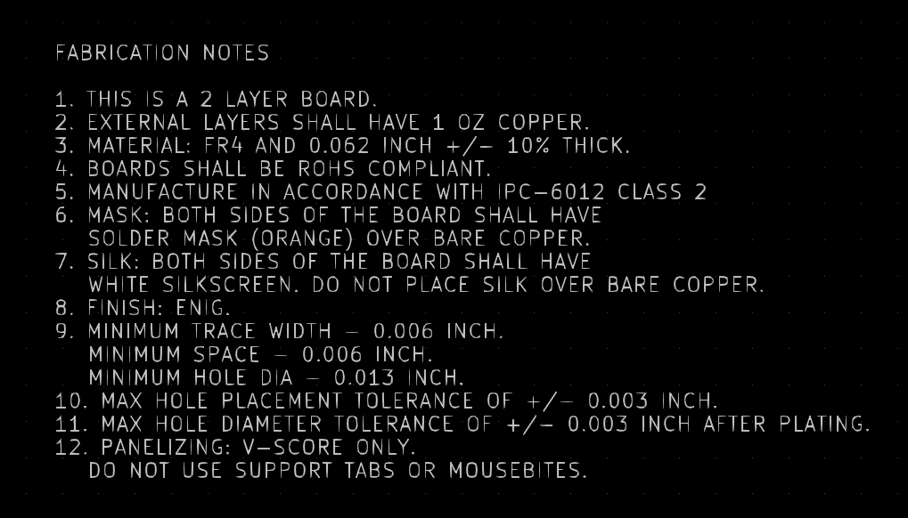

### 10. Fill in the description section of the README

If you haven't already, update the README description with anything you want the end users to know. Keep in mind that many of the folks using modules are teachers and students! Make it simple, clear, and helpful. 

Consider noting whether this module takes 3.3V or 5V, and if there are any external parts (like resistors) that are recommended with higher voltages. We'll also probably adjust this when we review the pull request, so don't worry too much about it.

### 11. Optionally create the gerbers

You can create them from the board layout screen by choosing `File > Plot`.  Make sure the output directory is set to `gerbers` and then click on `Plot` .

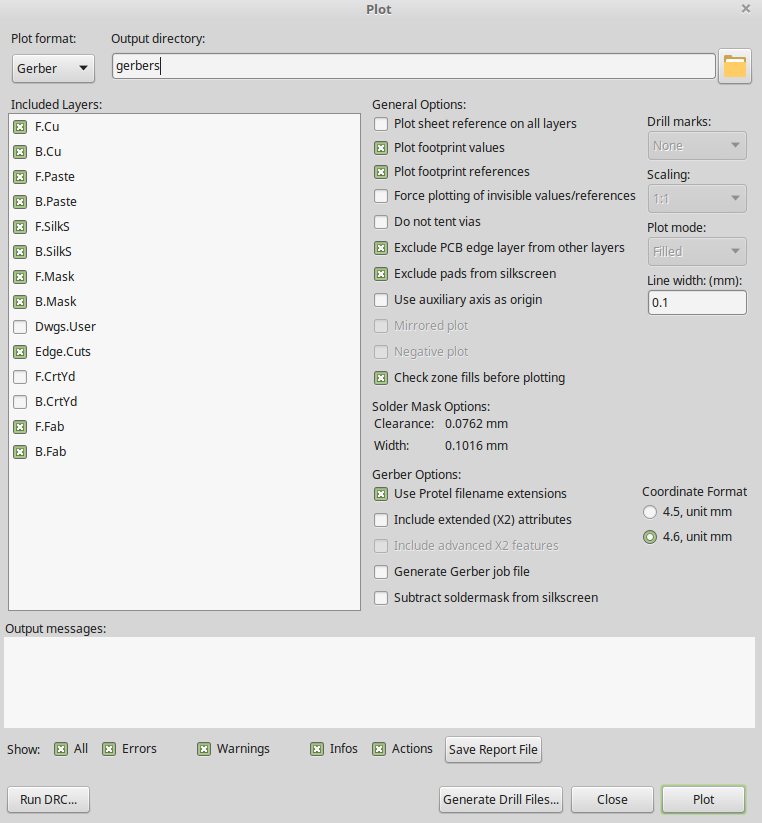

To generate the drills file, click on `Generate Drill Files...` at the bottom of the Plot panel. Make sure the output directory is the same and then click `Generate Drill File`. 

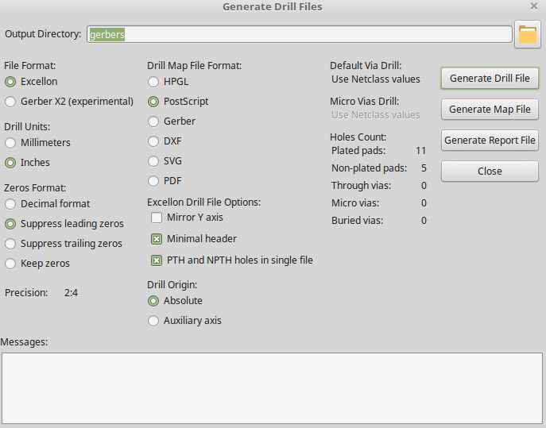

You can double check the gerbers in `gerbv`, a free and open source gerber viewer, or in KiCad's gerber viewer. OSH Park's gerber previews are pretty handy and user friendly -- just zip up the gerbers and drill file, and upload the zip file at [oshpark.com](http://oshpark.com). You don't have to save the project to view the image previews, but they're helpful to give you an idea about how the board will look. 

### 12. We will auto-generate the docs

We will generate the bill of materials, a set of gerbers which will overwrite the ones you create, combine the files into zips based particular vendor requirements, automatically create formatted PDFs. 

If you're curious, the process has been open sourced at [KiFisher](https://github.com/wickerbox/KiFisher). We use gerbv to generate preview images, Pandoc to create PDFs, and the whole thing's written in Python.

### 13. Submit a pull request

When you're ready for a review, send us a pull request. Log into GitHub to the CrazyCircuits repository under your account. Click on the Pull Request tab and then choose New Pull Request.

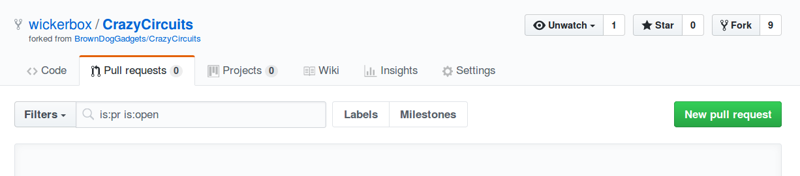

Select 'master' for BrownDogGadgets/CrazyCircuits and select your local branch with your new module.

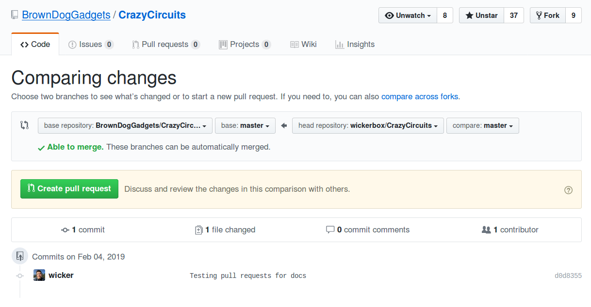

Click `Create Pull Request` and fill in as much information in the comment box as you want: who you are, if you have a particular project in mind, if there are any design decisions you had to make (such as if the surface mount pads made layout difficult), and so on.

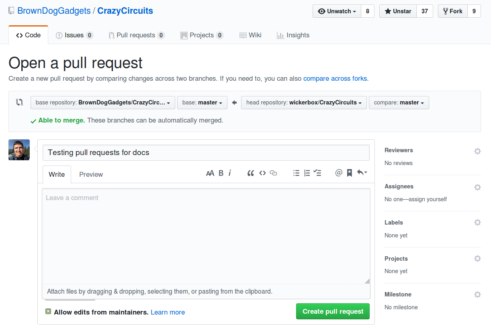

Click `Create Pull Request` one last time and we'll be in touch as soon as possible, probably within one or two business days. If you haven't heard from us in a few days, please add a comment and keep after us. Don't ever feel like you're bugging us -- on the contrary, we're excited that other people are getting value out of this project! 

If you have any questions, send an email to help@browndoggadgets.com and we'll do our best to help!
