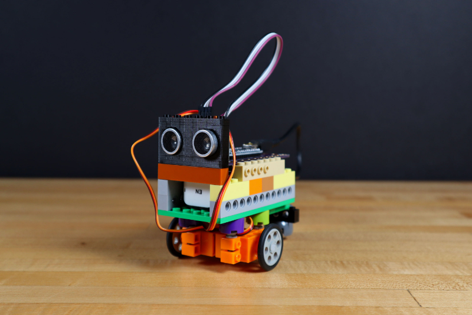

# Avoidance Robot

An Avoidance Robot built with Crazy Circuits components and LEGO parts.

Full build guide here: https://www.instructables.com/id/Obstacle-Avoiding-LEGO-Robot/

Electronic Parts Needed:
* 1 x [Crazy Circuits Robotics Board](https://www.browndoggadgets.com/collections/new-crazy-circuits-kits/products/crazy-circuits-robotics-board)
* 2 x [Brick Compatible Continuous Rotation 360 Degree Servo](https://www.browndoggadgets.com/products/brick-compatible-360-degree-servo)
* 1 x HC-SR04 Ultrasonic Distance Sensor
* 1 x USB Power Bank

We used the following LEGO parts, but YMMV:

* 1 x [LEGO Wedge Belt Wheel (4185 / 49750)](https://www.brickowl.com/catalog/lego-wedge-belt-wheel-4185-49750)
* 1 x [LEGO EV3 Technic Ball Pivots Set 5003245](https://www.brickowl.com/catalog/lego-ev3-technic-ball-pivots-set-5003245)
* 1 x [LEGO Technic Cross Block Beam 3 with Four Pins (48989 / 65489)](https://www.brickowl.com/catalog/lego-technic-cross-block-beam-3-with-four-pins-48989-65489)
* 1 x [LEGO Technic Brick 1 x 6 with Holes (3894)](https://www.brickowl.com/catalog/lego-technic-brick-1-x-6-with-holes-3894)
* 4 x [LEGO Axle 4 with End Stop (87083)](https://www.brickowl.com/catalog/lego-axle-4-with-end-stop-87083)
* 4 x [LEGO Half Bushing (32123 / 42136)](https://technicforall.brickowl.com/store/lego-half-bushing-32123-42136)
* 4 x [LEGO Brick 2 x 2 Round (3941 / 6143)](https://technicforall.brickowl.com/store/lego-brick-2-x-2-round-3941-6143)
* 1 x [LEGO Plate 6 x 12 (3028)](https://www.brickowl.com/catalog/lego-plate-6-x-12-3028)
* Variety of micellaneous LEGO pieces

The Arduino sketch `AvoidanceRobot` is included.

You will also need the NewPing library, which can be found here: https://bitbucket.org/teckel12/arduino-new-ping/wiki/Home

---

Brown Dog Gadgets

https://www.browndoggadgets.com/

