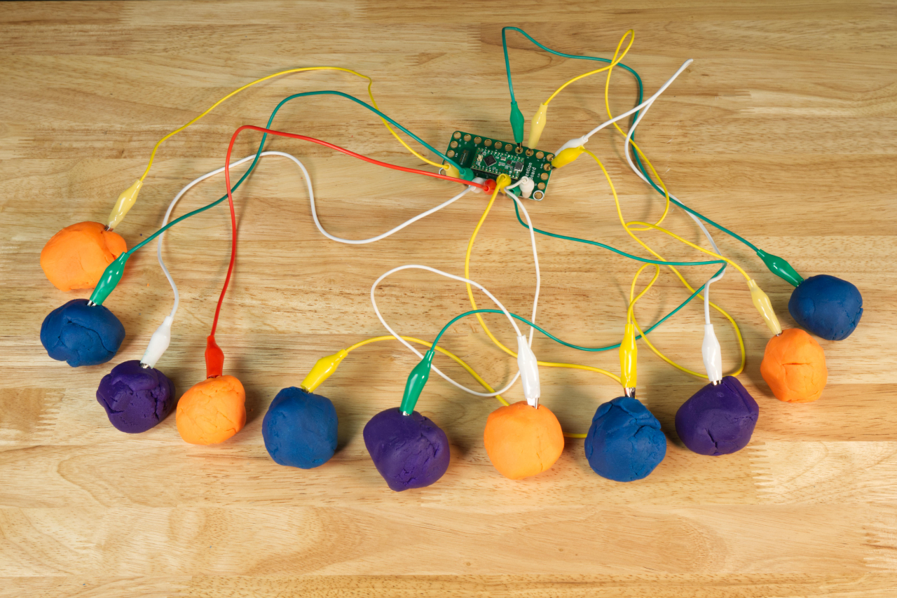

# BDG-11 Piano

A touch piano that plays 11 notes and works with a browser-based keyboard.

BDG-11 Piano utilizes the Crazy Circuits Invention Board connected to a computer to act as an input device.

Parts needed:
* 1 x [Crazy Circuits Invention Board](https://www.browndoggadgets.com/products/touch-board)
* 11 x Alligator Clips

Optional:
* Squishy Circuits Conductive Dough
* Maker Tape
* Bare Conductive Paint

## The Arduino sketch

You'll need to make sure you select USB Type: Keyboard from the Tools menu.

## Full Build Guide:

Check out our full guide: https://browndoggadgets.dozuki.com/Guide/BDG-11+Piano/354

---

Brown Dog Gadgets

https://www.browndoggadgets.com/

