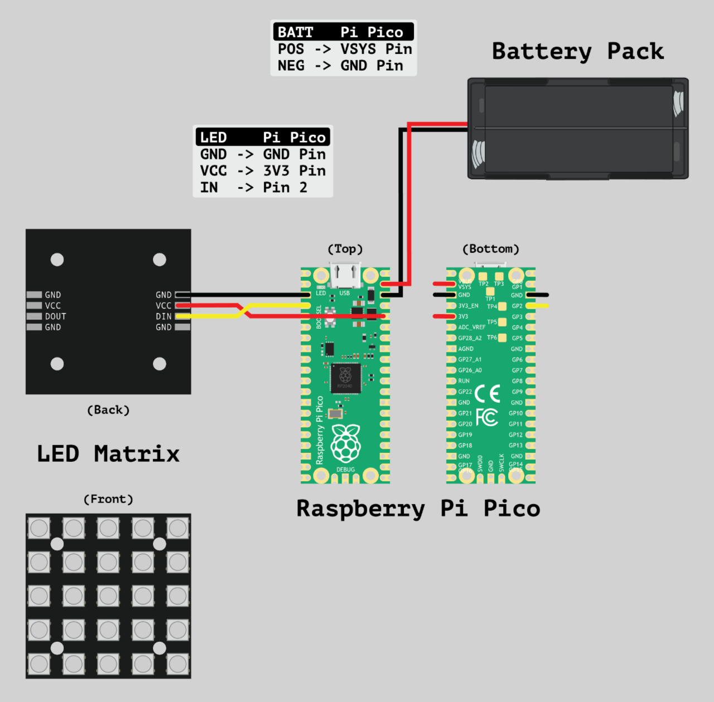

# BDG Large MicroBit

We've provided the HEX files `BDG_Large_MicroBit.ino.uf2` and `BDG_Large_MicroBit_Flipped.ino.uf2` if you just want to load the firmware and get it working.

We've also provided the Arduino sketch `BDG_Large_MicroBit.ino` if you want to make any changes.

Full build guide: https://learn.browndoggadgets.com/Guide/3D+Printed+(Large)+Micro:Bit/934 

---

Brown Dog Gadgets  
https://www.browndoggadgets.com/. 

