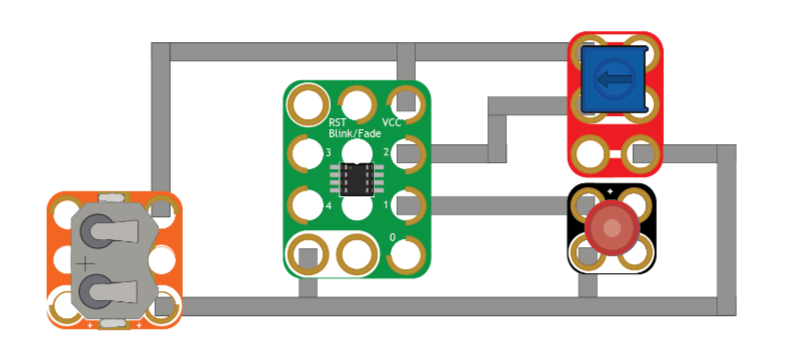

# BFDimmer

`BFDimmer` is an example sketch used in our tutorial on reprogramming the ATtiny85 on a [Crazy Circuits Blink/Fade Board](https://www.browndoggadgets.com/products/blink-fade-board).

The Blink/Fade Board comes preprogrammed with multiple blinking and fading effects, but advanced users may wish to reprogram it with their own code.

Full guide here: https://browndoggadgets.dozuki.com/Guide/Reprogramming+a+Blink-Fade+Board/227

---

Brown Dog Gadgets

https://www.browndoggadgets.com/

