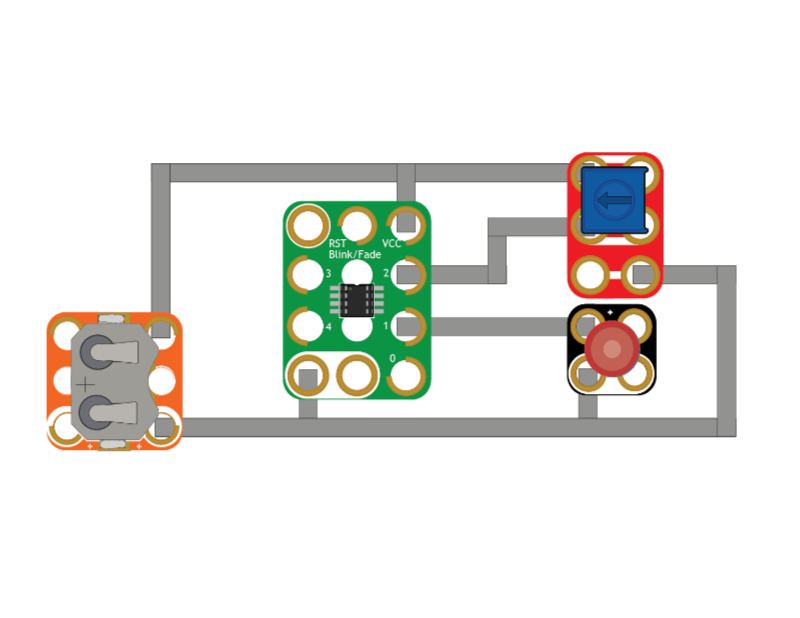

# BFDimmer

BFDimmer is an example sketch used in our tutorial on reprogramming the ATtiny85 on a Crazy Circuits Blink/Fade Board.

An Avoidance Robot built with Crazy Circuits components and LEGO parts.

Full guide here: https://browndoggadgets.dozuki.com/Guide/Reprogramming+a+Blink-Fade+Board/227

---

Brown Dog Gadgets

https://www.browndoggadgets.com/

