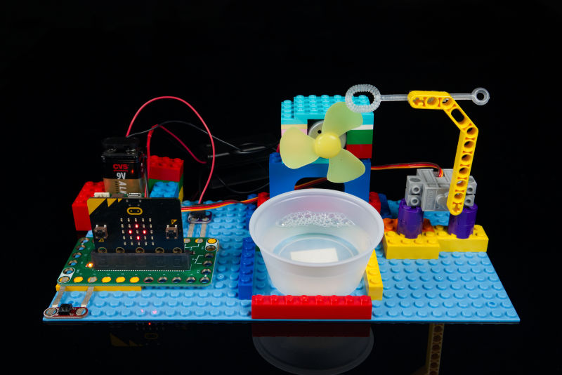

# Bubble Machine

A LEGO-based Bubble Machine utilizing the Crazy Circuits Bit Board along with a servo and DC motor. You can control it using an Adafruit Clue or a micro:bit

Parts needed:
* 1 x Crazy Circuits Bit Board (Coming Soon!)
* 1 x [Adafruit Clue](https://www.adafruit.com/product/4500) - or - [micro:bit](https://microbit.org/buy/)
* 1 x [Roll of 1/8" Maker Tape](https://www.browndoggadgets.com/products/nylon-conductive-tape)
* 1 x [Brick Compatible 270 Degree Servo](https://www.browndoggadgets.com/products/brick-compatible-270-degree-servo)
* 1 x [Crazy Circuits Standard Pushbutton Chip](https://www.browndoggadgets.com/products/1x3-pushbutton-chip)
* 1 x [Crazy Circuits Screw Terminal Chip](https://www.browndoggadgets.com/products/screw-terminal-chip)
* 1 x DC Motor with Fan Blade
* 1 x DC Power
* 1 x Small Cup
* 1 x LEGO Baseplate
* Misc LEGO pieces
* Bubble Wand & Bubble Soap

The Bit Board has a built-in relay on Pin 16 which we use to turn on and off the fan so we can blow bubbles. A servo on Pin 0 is activated by a button connected to Pin 1 to start the bubble blowing process.

## Adafruit Clue

The code is written in CircuitPython and to use it as-is just copy it to the Clue after you connect it to your computer with a USB cable.

## micro:bit

The code can be loaded into the MakeCode Editor: [Bubble Machine](https://makecode.microbit.org/_05vhF0CH27ML)

Full build instructions: https://browndoggadgets.dozuki.com/Guide/Bubble+Machine/237

---

Brown Dog Gadgets

https://www.browndoggadgets.com/

