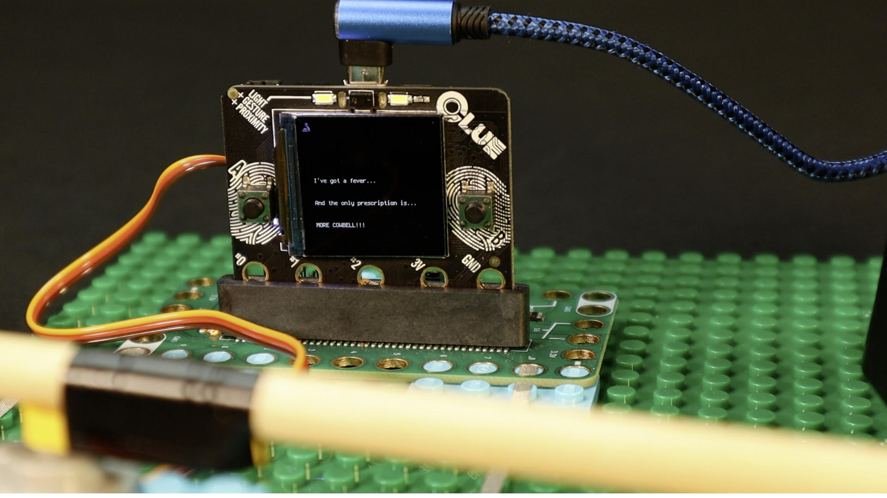
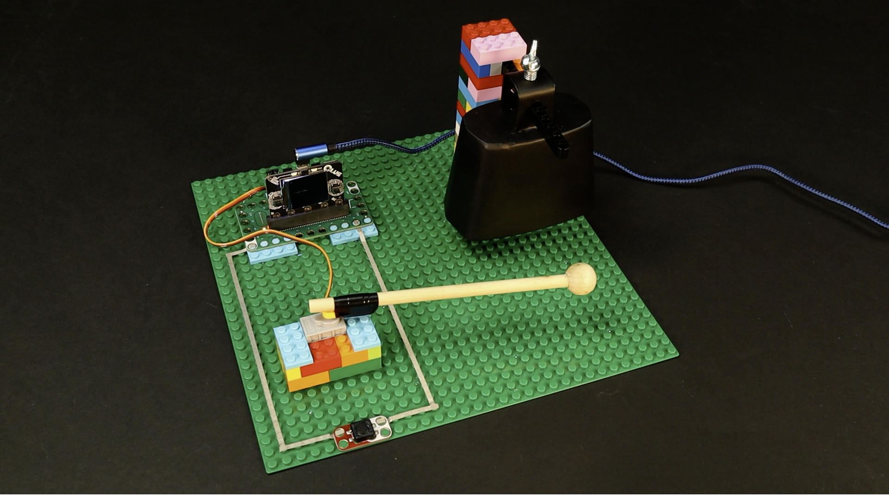
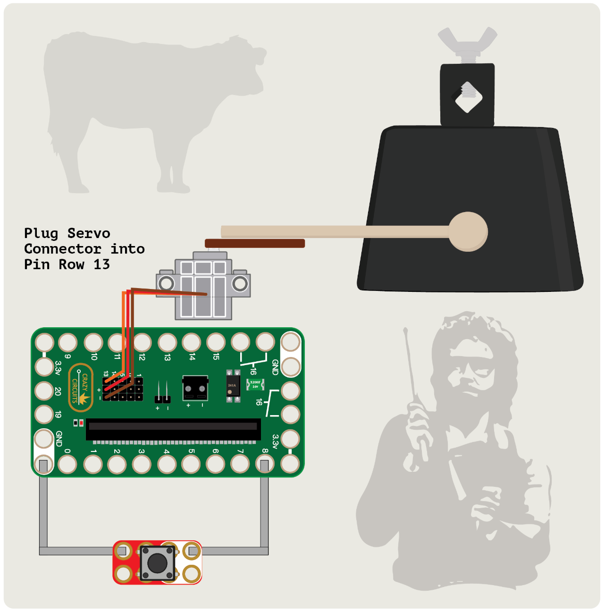

# CLUEbell

The **CLUEbell** is a Crazy Circuits LEGO-based project using a Bit Board and an Adafruit Clue.

## Adafruit Clue

The code is written in CircuitPython and to use it as-is just copy it to the Clue after you connect it to your computer with a USB cable.

This is based on our "Automatic Cowbell" project: https://browndoggadgets.dozuki.com/Guide/Automatic+Cowbell/361

---

Brown Dog Gadgets

https://www.browndoggadgets.com/

