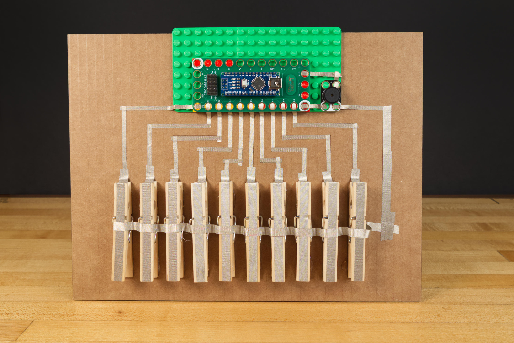

# Clothespin Piano

An Arduino-based piano using clothespins for the keys that is built with Crazy Circuits parts. Maker Tape is used for creating the switches of this piano.

Parts needed:
* 1 x [Crazy Circuits Robotics Board](https://www.browndoggadgets.com/collections/new-crazy-circuits-kits/products/crazy-circuits-robotics-board)
* 1 x [Crazy Circuits Piezo Speaker Chip](https://www.browndoggadgets.com/collections/all/products/piezoelectric-speaker-chip)
* 1 x [Roll of 1/8" Maker Tape](https://www.browndoggadgets.com/products/nylon-conductive-tape)
* 1 x [Roll of 1/4" Maker Tape](https://www.browndoggadgets.com/products/maker-tape-1-4th-inch-20m-roll-nylon-conductive-tape)
* 1 x LEGO Baseplate
* Misc LEGO pieces

The Arduino sketch `ClothespinPiano` is included along with a circuit diagram.

Full build instructions: https://browndoggadgets.dozuki.com/

---

Brown Dog Gadgets

https://www.browndoggadgets.com/

