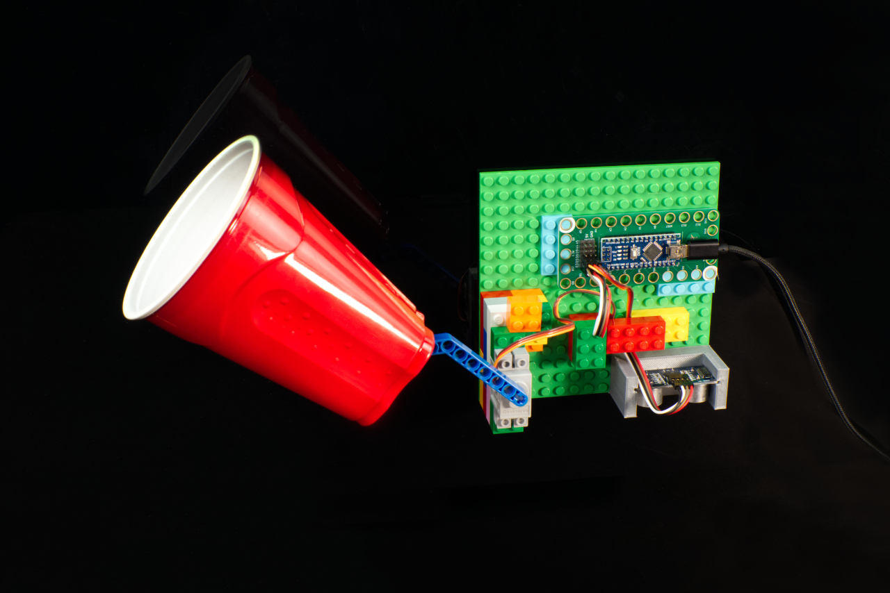

# Confetti Drop

Confetti Drop uses a Crazy Circuits Robotics Board with a distance sensor and a servo.

The Arduino sketch `Confetti-Drop` can be found in the **Arduino** folder.

Full build guide: https://browndoggadgets.dozuki.com/Guide/Confetti+Drop/311

---

Brown Dog Gadgets

https://www.browndoggadgets.com/

