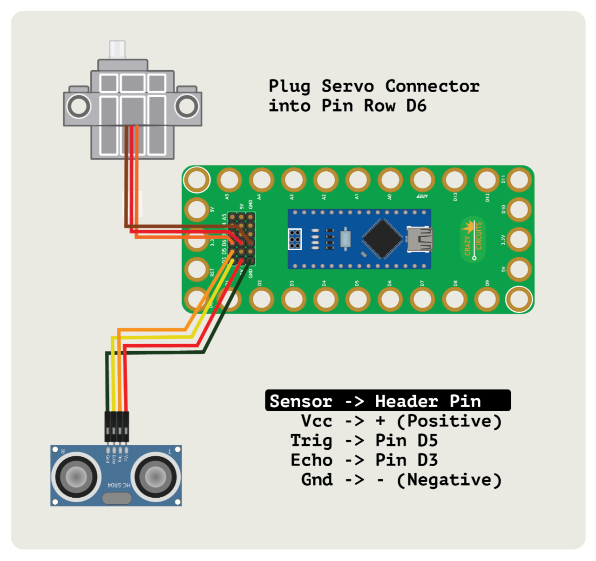

# Confetti Drop

Confetti Drop uses a Crazy Circuits Robotics Board along with a distance sensor and a servo to drop confetti on someone. Hilarious!

Parts needed:
* 1 x [Crazy Circuits Robotics Board](https://www.browndoggadgets.com/collections/tbm/products/crazy-circuits-robotics-board)
* 1 x [Brick Compatible 270 Degree Servo](https://www.browndoggadgets.com/products/brick-compatible-270-degree-servo)
* 1 x [HC-SR04 Ultrasonic Distance Sensor](https://www.browndoggadgets.com/products/distance-sensor)
* 1 x LEGO Baseplate
* Misc LEGO pieces

The Arduino sketch `Confetti-Drop` can be found in the **Arduino** folder.

Full build guide: https://browndoggadgets.dozuki.com/Guide/Confetti+Drop/311

---

Brown Dog Gadgets

https://www.browndoggadgets.com/

