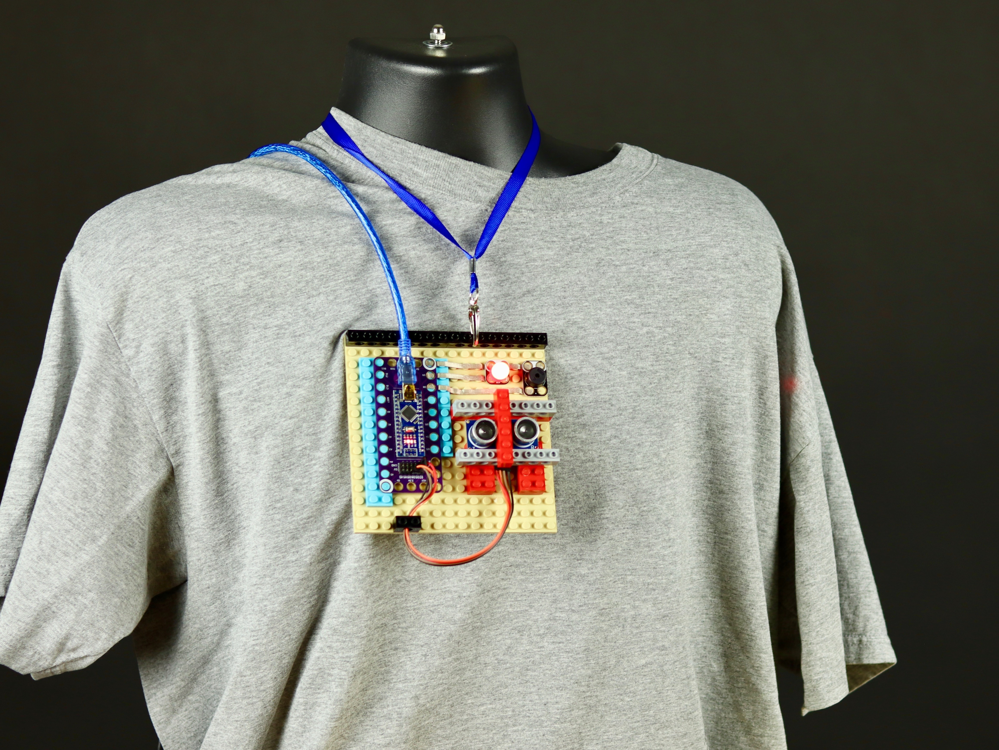

# Don't Touch Me Alarm

Full instructions here: https://browndoggadgets.dozuki.com/Guide/'Don't+Touch+Me'+Anti+Virus+Alarm/167

A simple Arduino project that uses an LED, Piezo Speaker, and an ultrasonic sensor to keep people at a distance.

You'll need to use the Arduino sketch along with the NewTone_v1.0 library (included).

---

Brown Dog Gadgets

https://www.browndoggadgets.com/

