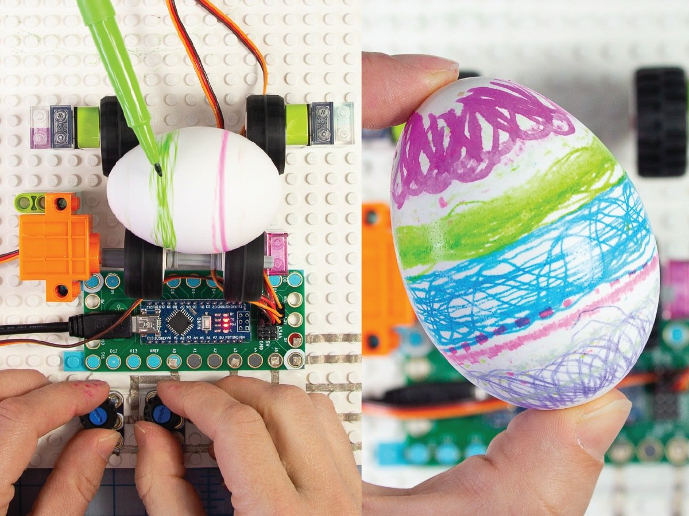

# L-egg-o Egg Decorating Robot

Full instructions here: https://browndoggadgets.dozuki.com/Guide/"L-egg-o"+Egg+Decorating+Robot/175

You'll need to use the Arduino sketch `Leggo_Mazing_Smooth.ino`

---

Brown Dog Gadgets

https://www.browndoggadgets.com/

