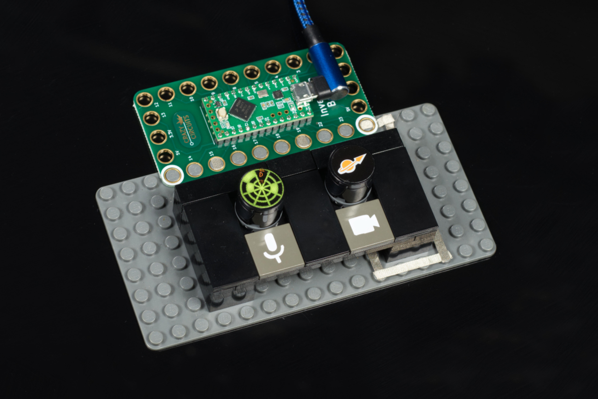
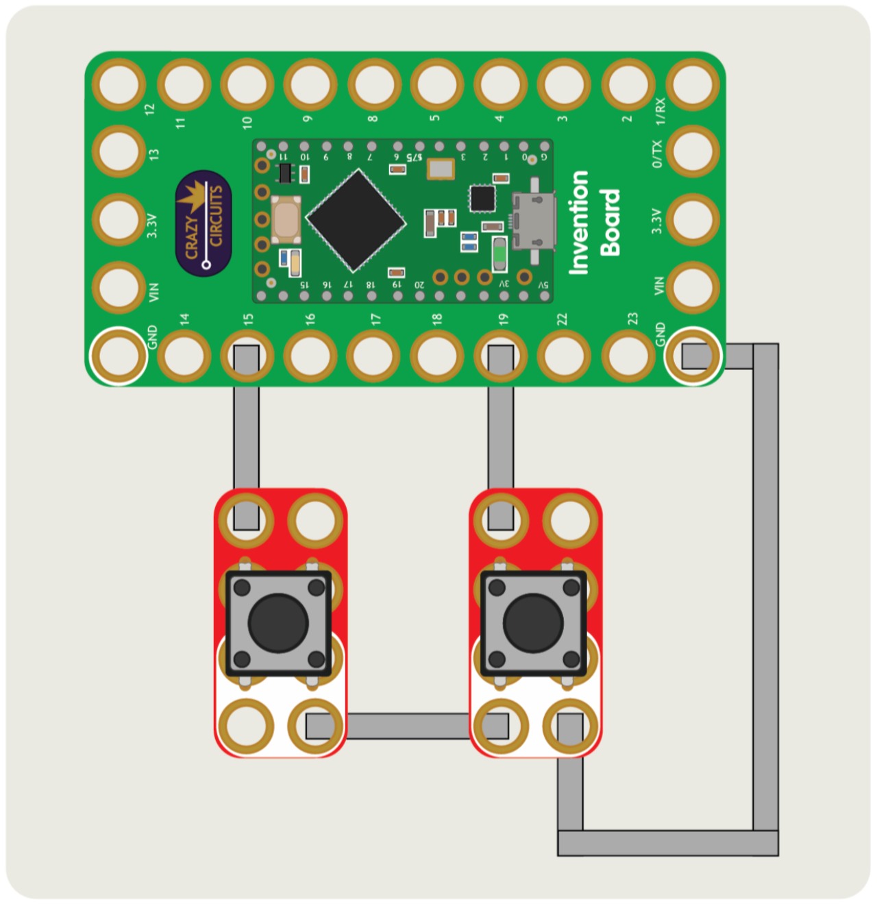

# Meeting Controls

A LEGO-based videoconferencing tool to toggle on and off your microphone and camera.

Meeting Controls utilizes the Crazy Circuits Invention Board connected to a computer to act as a USB keyboard.

Parts needed:
* 1 x [Crazy Circuits Invention Board](https://www.browndoggadgets.com/products/touch-board)
* 2 x [Crazy Circuits Jumbo Pushbutton Chip](https://www.browndoggadgets.com/products/2x4-pushbutton-chip)
* 1 x LEGO Baseplate
* Misc LEGO pieces

The Arduino sketches available should work with Google Meet, Zoom, and Microsoft Teams.

You'll need to choose the correct sketch and edit the `OS` parameter to choose if you want it to work on **macOS** or **Windows**.

Full build instructions coming soon!

---

Brown Dog Gadgets

https://www.browndoggadgets.com/

