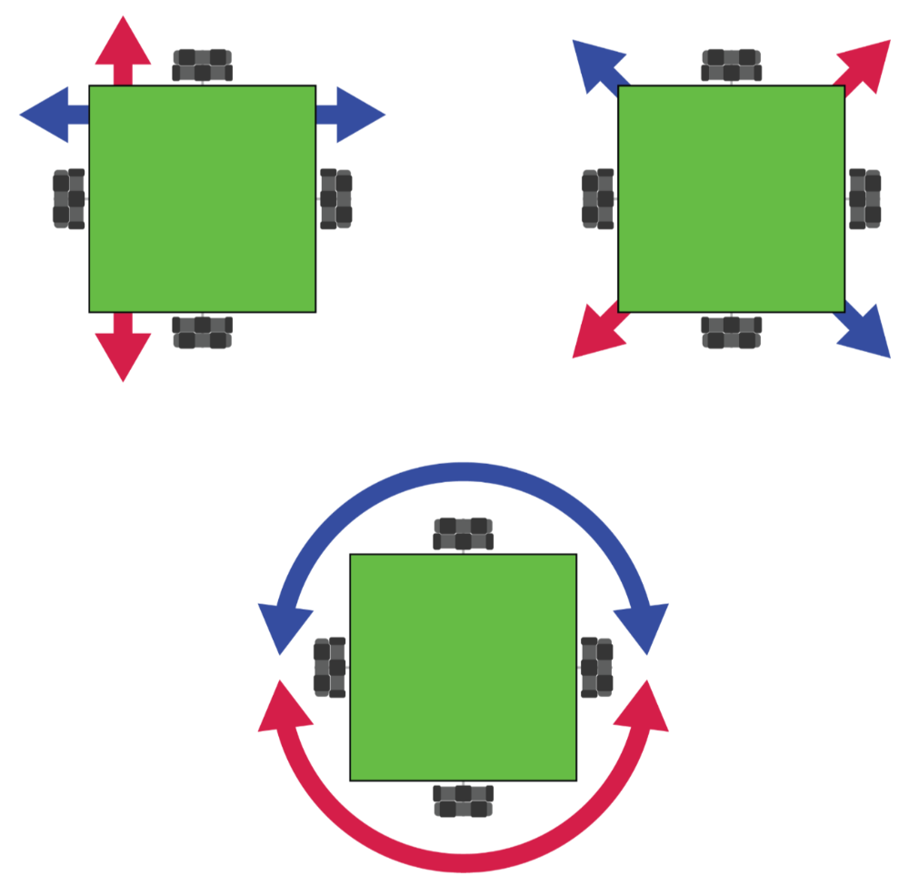

# Omni Wheel Robot

Omni Wheel Robot uses a Crazy Circuits Robotics Board with four Brick Compatible continuous rotation servos.

Parts needed:
* 1 x [Crazy Circuits Robotics Board](https://www.browndoggadgets.com/collections/tbm/products/crazy-circuits-robotics-board)
* 4 x [Brick Compatible Continuous Rotation 360 Degree Servo](https://www.browndoggadgets.com/products/brick-compatible-360-degree-servo)
* 1 x [3AA Battery Holder](https://www.browndoggadgets.com/products/aa-battery-holder-tripple)
* 4 x Omni Wheels
* 1 x LEGO Baseplate
* Misc LEGO pieces
* _Note: See the full build guide for a list of all components used_

The Arduino sketch `Omni_Wheel_Robot` can be found in the **Arduino** folder.

Full build guide: https://browndoggadgets.dozuki.com/Guide/Omni+Wheel+Robot/310

---

Brown Dog Gadgets

https://www.browndoggadgets.com/
