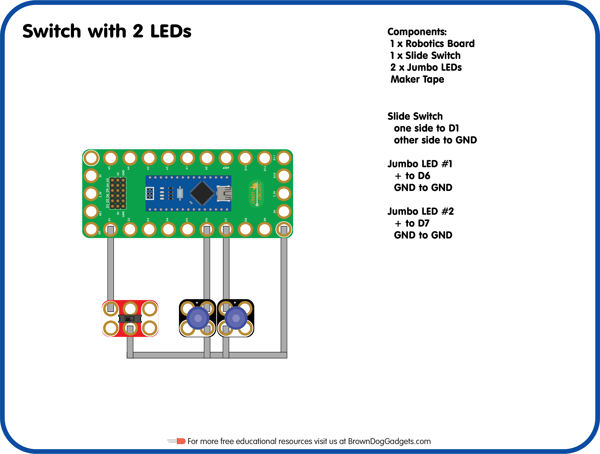

# 03 - Switch_with 2 LEDs

Lesson Plan for the [Crazy Circuits Classroom Set: Programing 101](https://www.browndoggadgets.com/collections/new-crazy-circuits-kits/products/crazy-circuits-classroom-set-programing-101)

Upload the Arduino sketch `Switch_with_2_LEDs.ino` to your Robotics Board.

Full build guide here: https://browndoggadgets.dozuki.com/Guide/03+-+Switch+with+2+LEDs/206

---

Brown Dog Gadgets

https://www.browndoggadgets.com/

