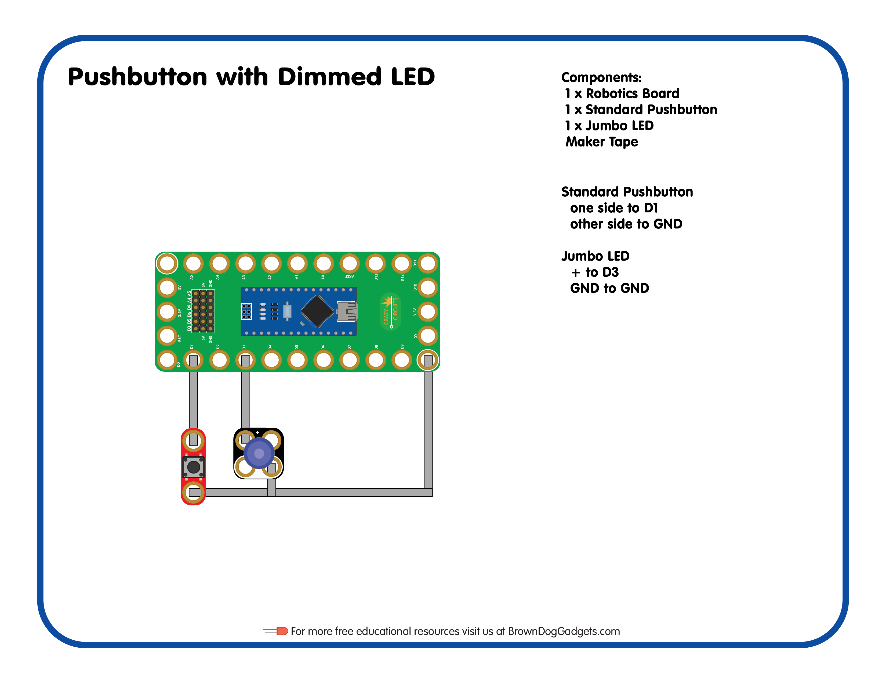

# 04 - Pushbutton with Dimmed LED

Lesson Plan for the [Crazy Circuits Classroom Set: Programing 101](https://www.browndoggadgets.com/collections/new-crazy-circuits-kits/products/crazy-circuits-classroom-set-programing-101)

Upload the Arduino sketch `Pushbutton_with_Dimmed_LED.ino` to your Robotics Board.

Full build guide here: https://browndoggadgets.dozuki.com/Guide/04+-+Pushbutton+with+Dimmed+LED/207

---

Brown Dog Gadgets

https://www.browndoggadgets.com/

