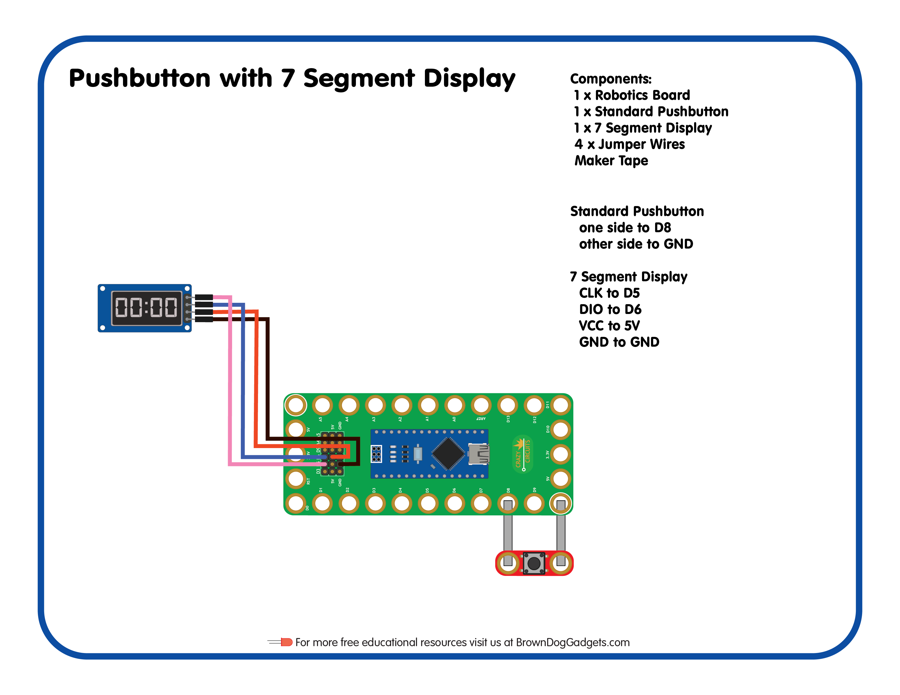

# 13 - Pushbutton with 7 Segment Display

Lesson Plan for the [Crazy Circuits Classroom Set: Programing 101](https://www.browndoggadgets.com/collections/new-crazy-circuits-kits/products/crazy-circuits-classroom-set-programing-101)

Upload the Arduino sketch `Pushbutton_with_7_Segment_Display.png.ino` to your Robotics Board.

Full build guide here: https://browndoggadgets.dozuki.com/Guide/13+-+Pushbutton+with+7+Segment+Display/216

---

Brown Dog Gadgets

https://www.browndoggadgets.com/

