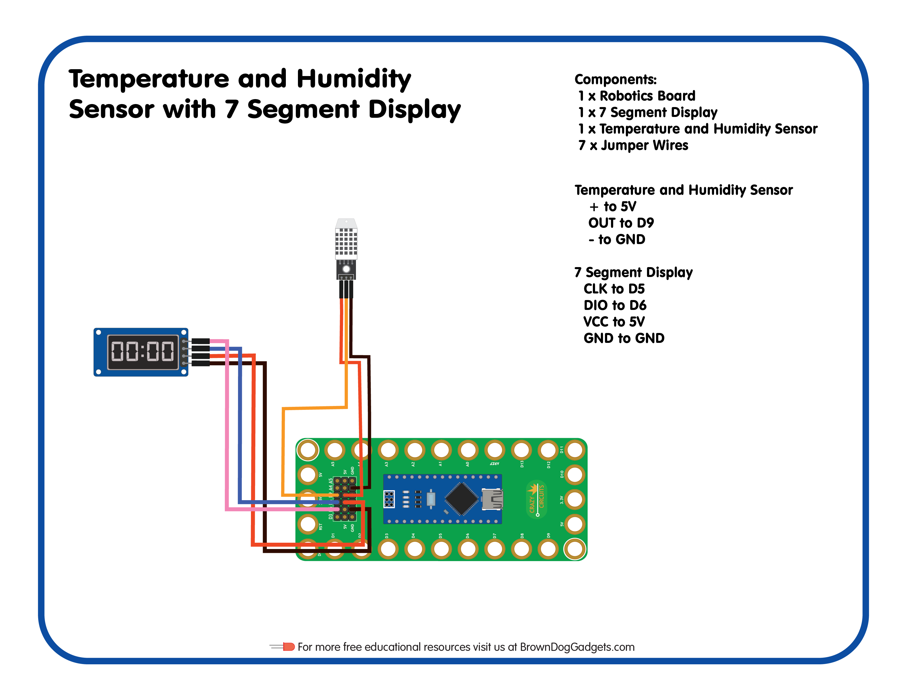

# 15 - Temperature and Humidity Sensor with 7 Segment Display

Lesson Plan for the [Crazy Circuits Classroom Set: Programing 101](https://www.browndoggadgets.com/collections/new-crazy-circuits-kits/products/crazy-circuits-classroom-set-programing-101)

Upload the Arduino sketch `Temperature_and_Humidity_Sensor_with_7_Segment_Display.ino` to your Robotics Board.

_Note: You will need to install the TM1637 library by Avishay Orpaz as well as the DHT sensor library by Adafruit_

Full build guide here: https://browndoggadgets.dozuki.com/Guide/15+-+Temperature+and+Humidity+Sensor+with+7+Segment+Display/218

---

Brown Dog Gadgets

https://www.browndoggadgets.com/

