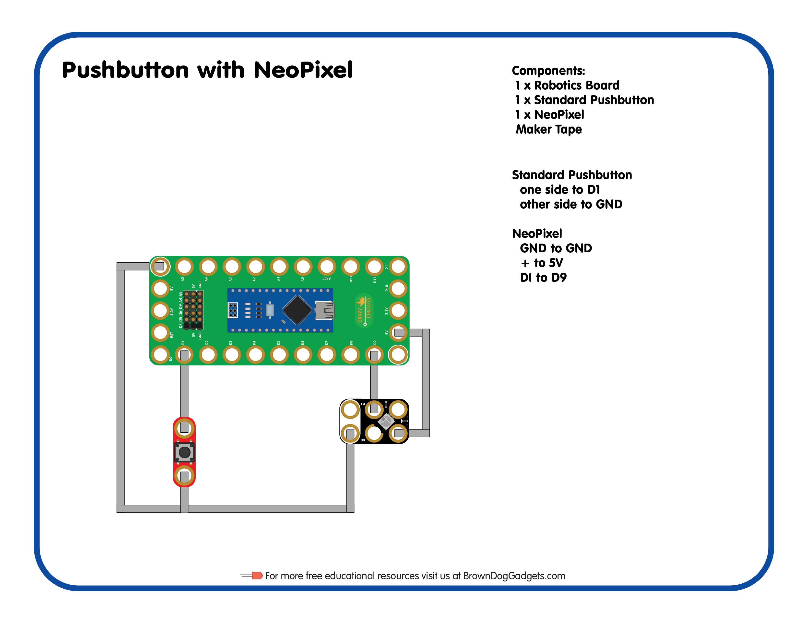

# 16 - Pushbutton with NeoPixel

Lesson Plan for the [Crazy Circuits Classroom Set: Programing 101](https://www.browndoggadgets.com/collections/new-crazy-circuits-kits/products/crazy-circuits-classroom-set-programing-101)

Upload the Arduino sketch `Pushbutton_with_NeoPixel.ino` to your Robotics Board.

_Note: You will need to install the NeoPixel library by Adafruit_

Full build guide here: https://browndoggadgets.dozuki.com/Guide/16+-+Pushbutton+with+NeoPixel/219

---

Brown Dog Gadgets

https://www.browndoggadgets.com/

