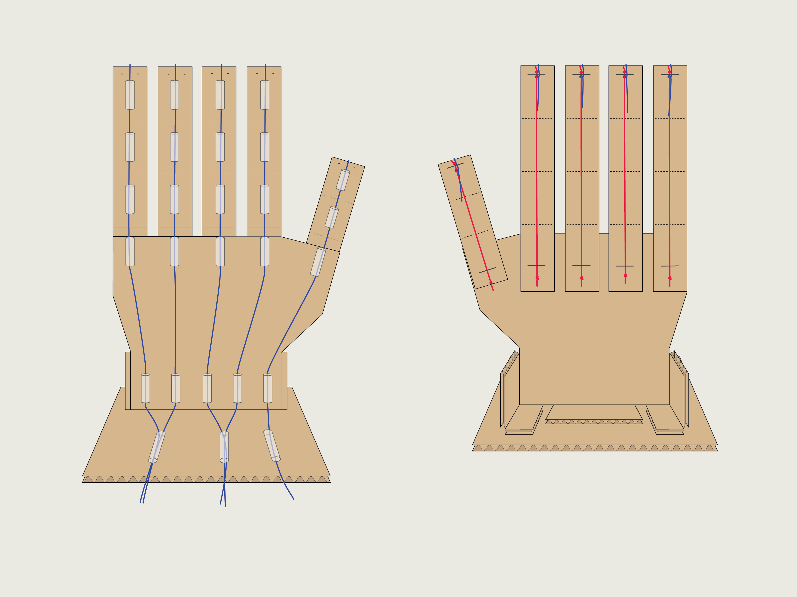

# Robotic Hand

A robotic hand built using cardboard, string, rubber bands, and drinking straws.

Built with Crazy Circuits components and LEGO parts.

We have a full build guide listing all of the components and every LEGO part needed: https://browndoggadgets.dozuki.com/Guide/Robotic+Hand+(Robotics+Board)/384

The Arduino sketches `Robotic-Hand` and `Servo-Setup` are included.

---

Brown Dog Gadgets

https://www.browndoggadgets.com/

