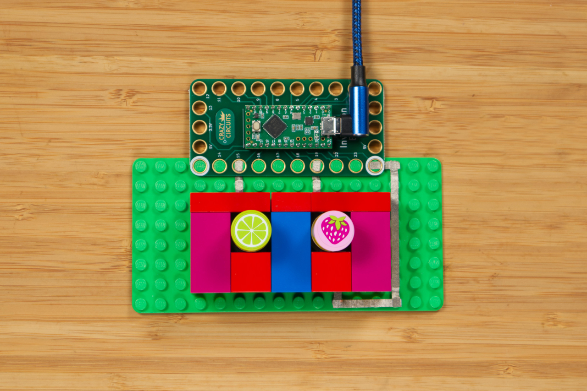
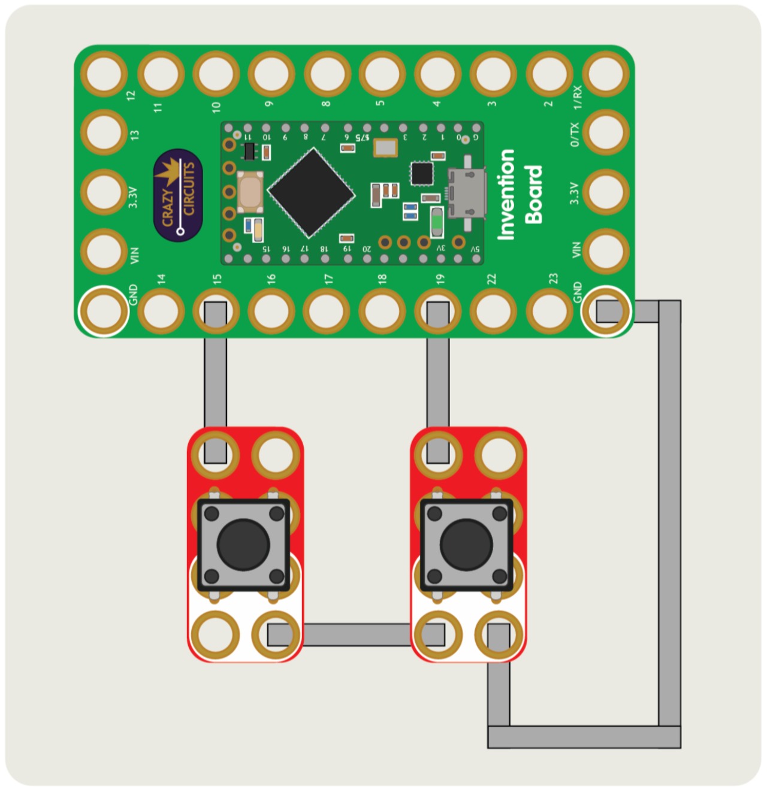

# SlideControl

A LEGO-based tool to let your producer know when it's time to change the slide...

SlideControl utilizes the Crazy Circuits Invention Board connected to a computer to act as an input device.

Parts needed:
* 1 x [Crazy Circuits Invention Board](https://www.browndoggadgets.com/products/touch-board)
* 2 x [Crazy Circuits Jumbo Pushbutton Chip](https://www.browndoggadgets.com/products/2x4-pushbutton-chip)
* 1 x LEGO Baseplate
* Misc LEGO pieces

## The Arduino sketch

You'll need to make sure you select USB Type: MIDI from the Tools menu.

## The Processing Sketch

You will need to make sure you got themidibus library installed, and set the MidiBus objext to the correct input and output.

## Full Build Guide:

Coming Soon!

---

Brown Dog Gadgets

https://www.browndoggadgets.com/

