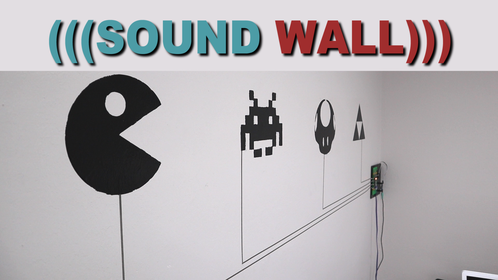

# Sound FX Board

This project allows you to use the Crazy Circuits Invention Board (or Teensy LC) to create a capacitive touch sound wall. We use a cheap YX5300 mp3 module to play MP3 or WAV files.

You can find a full write up of this project on our website as well as Instructables.com. We also have a YouTube video you can watch that shows how to build the thing.

Full build instructions: https://learn.browndoggadgets.com/Guide/MP3+Playing+Sound+FX+Wall/176

YouTube Video Build: https://www.youtube.com/watch?v=dt47v8oeJfE

All the resources are found in the ZIP file. The code and test files set up in folders. Download that to get started.

The code is set up so that certain pins play certain files. We have them set up with a 1 second delay after each sound effect is triggered. You can change that length if you really want to. You can also change the sensitivity of the capacitive touch feature. This is handy if you want to trigger a touch point BEHIND something, like a sheet of paper or a vinyl sticker.

Download the `Test Sound Effects` folder and copy all the folders inside it to your micro SD card. Format the card as MS-DOS (FAT32). To change the sound effect just delete the test .WAV file in each folder and replace it with your own MP3 or WAV file.

**For macOS users:** You'll need to download the DotClean Application: https://github.com/raster/DotClean

We use Bare Conductive paint as our touch points, however most anything conductive will work. You could just make a simple shape with conductive tape and the place paper over the top of it or even a vinyl sticker.

---

Brown Dog Gadgets

https://www.browndoggadgets.com/

