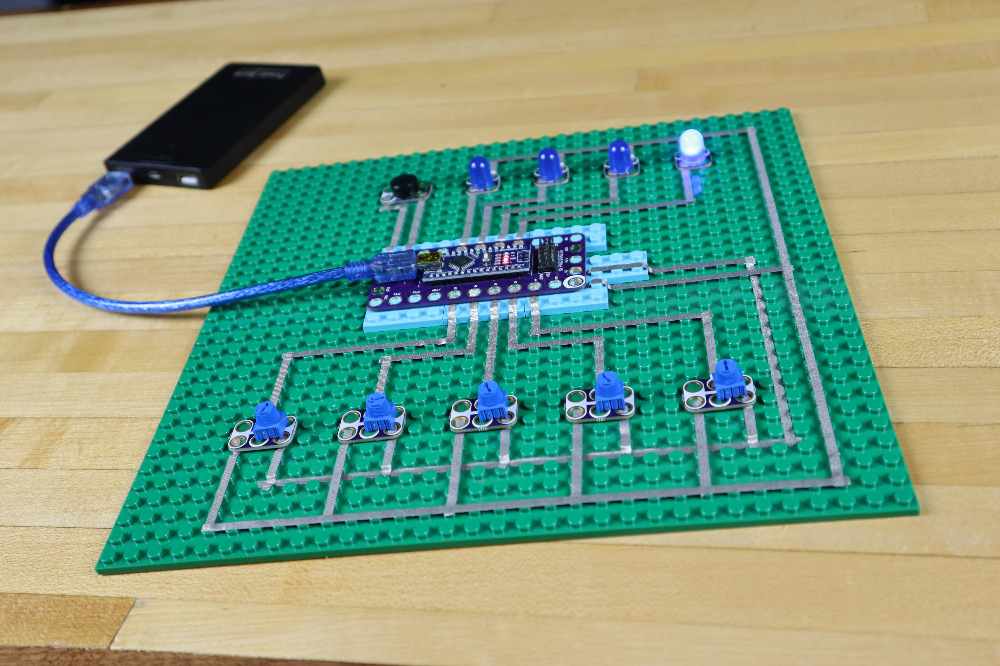

# Step Sequencer

A Step Sequencer built with Crazy Circuits parts on a LEGO baseplate. You can experiment with making your own beats using the four step audio sequencer. Set the frequency for each of the four notes and control the speed with the tempo potentiometer. The LEDs will light up to correspond with the note being played.

Parts needed:
* 1 x [Crazy Circuits Robotics Board](https://www.browndoggadgets.com/collections/new-crazy-circuits-kits/products/crazy-circuits-robotics-board)
* 4 x [Crazy Circuits LEDs](https://www.browndoggadgets.com/collections/all/products/blue-jumbo-diffused-led-chip)
* 5 x Crazy Circuit Potentiometers (Coming Soon!)
* 1 x [Crazy Circuits Piezo Speaker Chip](https://www.browndoggadgets.com/collections/all/products/piezoelectric-speaker-chip)
* 1 x [Roll of 1/8" Maker Tape](https://www.browndoggadgets.com/collections/new-crazy-circuits-supplies/products/nylon-conductive-tape)
* 1 x LEGO Baseplate
* Misc LEGO pieces

The Arduino sketch `StepSequencer` is included along with a circuit diagram.

Full build instructions: https://browndoggadgets.dozuki.com/Guide/Step+Sequencer/156

---

Brown Dog Gadgets

https://www.browndoggadgets.com/

