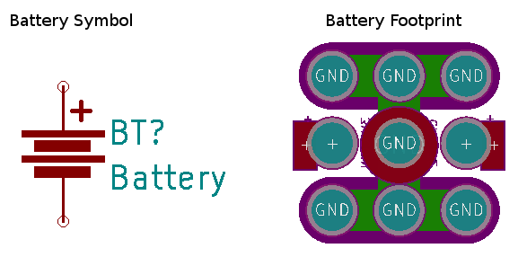

# Rewire Circuits 
#### Lego-compatible circuit kits and modules by Brown Dog Gadgets

Brown Dog Gadgets created the Rewire project to produce open source, Lego-compatible educational circuit kits. 
  
This repository is currently private and may not be publicly shared without express written permission.

### Contents

- Circuit Kits and Modules
- KiCad Library
- KiCad Template

- Instructions
  1. How to open the project template
  2. How to create circuits
  3. How to create modules

### Development

### Most Recent Notes

- Shrink overall size dimensions of boards to fit better on Legos (see dimension diagram)
- 196 mils hole size is good
- White silk for ground/- polarity markings where needed
- Circuit kits are initially connected and usable without being unsnapped. Complete circuit. 
- Use 2x2 snappable support tabs with 20mil drills and 6 mil traces. Make traces go at right angle on the board to help with clean snap of the trace.
- Beveled edge, no need to make it a clover.

Goals: 

1. Work out of the box as a circuit.  (Customer confidence, quantity control, cool factor.)
1. Break apart easily.  (Thats what we expect the majority of people to do with it.)

---
# Ignore all stuff below this line

### Background

KiCad is a free, open source schematic capture and board layout tool that can be downloaded for Linux, Mac, and Windows. <a href="#">Get KiCad here</a>.

The Rewire Circuit library contains Rewire Modules. The Rewire Modules contain a schematic symbol in the rewire.lib and rewire.dcm component library, and board layout symbol in the Rewire_Circuits.pretty folder.  

The template makes it easy to create a new Rewire Circuit kit in KiCad. Just add symbols, connect the symbols with wires, arrange the footprints on the printed circuit board, and add an outline showing the edge of the board or boards. 

### Existing Kits

- 

### How to Open the Project Template

### How to Create Circuits

### How to Create Modules

- Minimum drill hole size after plating is 194 mils (4.9mm)
- Minimum total via pad size is 208 mil (5.28mm) 
- Grid size should be 8mm. Holes should be centered on grid lines.

### Older (Rewrite and incorporate above!)

1. Clone this repository.
1. Copy the `KiCad_Project_Template` folder and make a new folder in `tests`, such as `tests/projectname/`.
1. Rename the three internal files to match the `projectname.pro`, `projectname.sch`, and `projectname.kicad_pcb`.
1. Open `projectname.pro` in KiCad.

To just select and order existing standalone Rewire circuit boards, 
 
1. Open `projectname.kicad_pcb` from the left-hand menu.
1. Change the path to point to the `Rewire_Circuits.pretty` library.
1. Verify the User Grid is 4mm. Lego-compatible drill spacing will be 8mm.
1. Place footprints on the grid. 
1. Use the wire tool to draw edges on the Edge Cuts layer. Round the corners; sides should be flat. 
1. Add copper traces and additional silk where desired.
1. Create gerbers using the `Plot` tool and <a href="http://docs.oshpark.com/design-tools/kicad/generating-kicad-gerbers/">these instructions</a>.
1. Submit the gerbers to the fab house of your choice. 

To create a connected circuit, such as the `tests/attiny85-v1/` example, 

1. Open `projectname.sch` from the left-hand menu.
1. Change the library path to point to the `rewire_circuits.lib` library.
1. Place components and connect them as you would any other schematic.
1. If components don't exist, create new rewire symbols from existing KiCad repositories.
1. Iterate between schematic and layout until atch the pad and pin numbers of symbols with the unorthodox pad numbers.
1. Add standalone holes on the 8mm grid in the layout to fill out the holes.
1. Add copper traces and additional silk where desired.
1. After creating gerbers, edit them in a gerber viewer to delete any extra traces or hole plating. 
1. Submit the gerbers to the fab house of your choice.

### Creating a Panelized Design for OSH Park

If using the 2-layer OSH Park prototyping service to design panels,

- Follow the <a href="http://docs.oshpark.com/services/two-layer/">Design Rules</a> and <a href="http://docs.oshpark.com/submitting-orders/panelized-designs/">Subpanel Instructions</a>.
- Leave 100 mils between board outlines so the fab will add support tabs and mill the boards separately.
- Draw another line around the entire panel structure at least 300 mils away from everything so the boards won't be depaneled. The panel will come complete.
- If creating snappable panels, place unplated drill hits at least 13 mil wide along the line where you want the boards to be snapped apart. 

### Contribute

The Rewire_Circuits.pretty library contains .kicad_mod footprint modules that work automatically with the 8mm grid. To create new library modules, you'll want to open the library in the Footprint Editor and use these rules of thumb: 

- Lego plugs have a diameter of 189 mils. Drill holes of at least 193 mils will account for the OSH Park tolerance +/- 2.5 mils, and result in a snug fit. 
- Minimum annular ring of 7mils means a minimum total via diameter of 7 + 193 + 7 = 207 mils. When possible, a 6mm annular ring is preferred.
- Define the User Grid as 4mm to be half the pitch of standard medium Lego spacing.
- Place the origin coordinate at any point 4mm from any two given pads, to make panelization easier. 
- Expose as much copper on the bottom layer as possible by adding tracks on the copper and bottom mask layers.
- White silk is used to mark negative pads. 
- As many pads as possible should be conductive. 
- See the <a href="#">Demo Panel v2</a> for examples of the rounded corners and flat edges of individual pieces.
- Place a silk name of the piece on the bottom layer. 
- Place text silk markings of polarity (if desired) on the top 
- Place silk polarity markings on the bottom if desired. 8mm tracks nicely fit the board contours if drawn between two drill holes.
- Update the description with as much info as possible, including reference part PDF datasheets.
- Name the part to generally match the other library parts. For example, `SPEAKER-PIEZO-5MMPitch-PS12-PS14-2x2`

*Note*

- There are no fabrication, courtyard, or assembly layers on the prototype parts as of March 2016. These will be added later if we go to production.

## Background Information

First, a set of size test boards were created in Eagle using the 'medium' Lego dimensions, created a set of Lego circuit demos in Eagle to see what size of drill is the best fit, using OSH Park design rules. 

More information here: <a href="https://github.com/wicker/bdg-legos/tree/master/via-size-test/">bdg-legos/via-size-test</a>

__Quick Conversions__

- 3.9 mm = 153 mil
- 4 mm = 158 mil
- 4.8 mm = 189 mil
- 4.88 mm = 192 mil (minimum drill)
- 4.91 mm = 193 mil (ideal drill)
- 5.23 mm = 206 mil (minimum total via)
- 8 mm = 315 mil
- 15.8 mm = 622 mil

## Demo Panel v1 

The first panel didn't have rounded corners, and included three types of modules (Platform, Bridge, Edge) to test the look and fit. On polarized devices on panel v1, white silk indicates the positive polarity and the PCB color indicates negative polarity. If there is no white side, the device is reversible and has no polarity.

## Demo Panel v2

The second panel had rounded corners, entirely Platform style, and was effectively the final set of prototypes to take to NSTA. The Rewire_Circuits.pretty library included lots of small fixes as per feedback from Demo Panel v1.

Opposite from the first demo panel, the positive areas are indicated by board mask color and the negative areas by white silk. Markings should be placed on the top of the board, since the bottom of the board will have as much exposed copper as possible.

As many lego holes as possible should be conductive on a given part, even if a two-pad part is placed on a 2x2 (four-pad) Lego piece. If possible, super simple silk names on the bottom of the board, like the Demo Panel v1. 

## VUSB ATTiny85 

- USB PCB connector (traces)
- (1) 3V coin cell (CR2032)
- (1) 3V coin cell holder (any compatible) 
- (1) Reset pushbutton (Omron B3F-1XXX)
- (1) ON/OFF slide switch (EG1218)
- (2) 220 ohm TH resistors 
- (1) 10uF 5mm pitch ceramic capacitor
- (1) 100nF 2.5mm pitch ceramic capacitor
- (2) 3.6V Zener diodes (BZX79-C3V6,133)
- (1) ATTiny85 8DIP microcontroller

It's important to turn the switch to OFF before plugging in the system. This protects the battery from the USB voltage. Also the USB trace routing is not ideal but we'll see how it goes.
